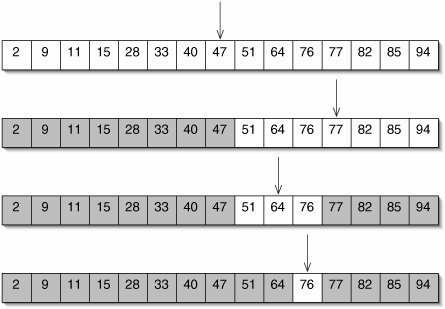
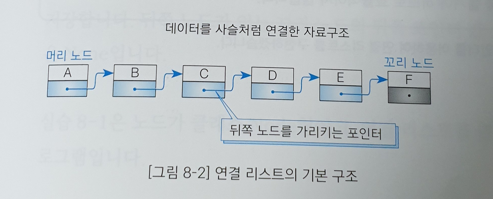
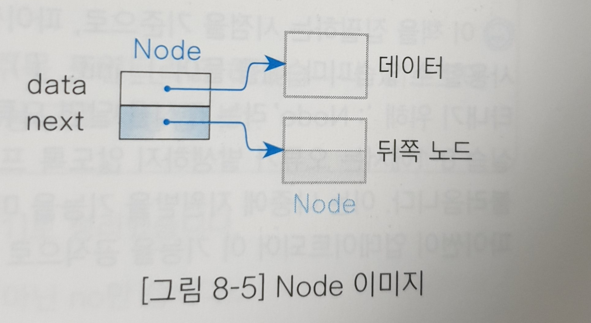
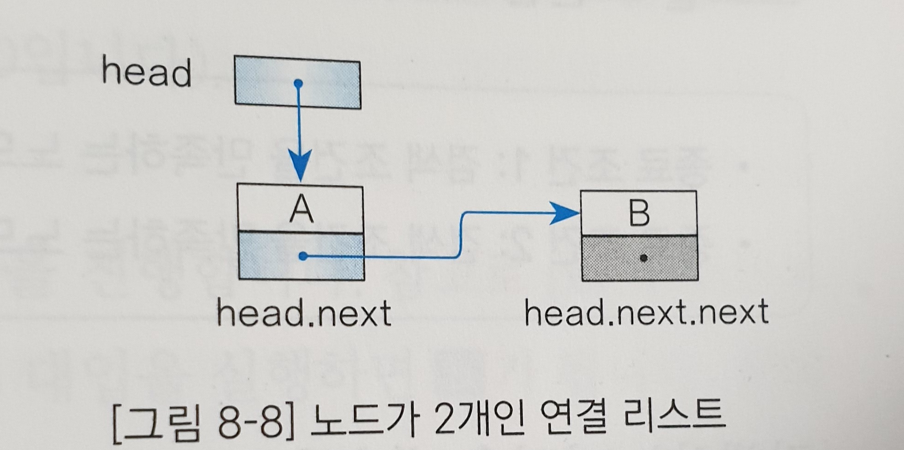
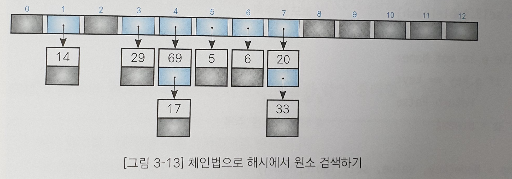
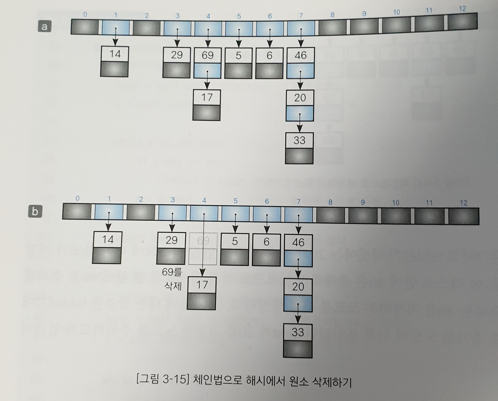
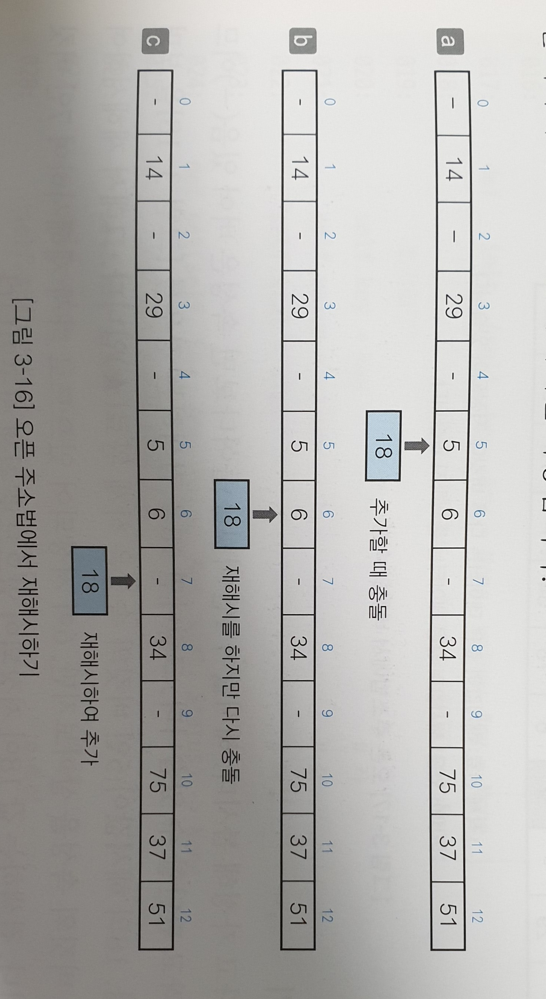

# 3. 검색 알고리즘

## 03-1. 검색 알고리즘이란?

> **검색과 키**
>
> 주소록을 검색한다고 할 때,
>
> - 국적이 한국인 사람을 찾습니다.
> - 나이가 21세 이상 27세 미만인 사람을 찾습니다.
> - 이름에 '민'자가 들어간 사람을 찾습니다.
>
> 위 검색 조건들은 모두 어떠한 항목에 주목하고 있고, 이렇게 주목하는 항목을 키(key)라고 한다. 국적으로 검색하는 경우 국적이 키고, 나이로 검색하는 경우 나이가 키인 것이다. 대부분의 경우 키는 **데이터의 일부**이다. 데이터가 간단한 정숫값이나 문자열이면 데이터값이 그대로 키값이 될 수도 있다. 위의 주소록 검색 조건을 수행하려면 다음과 같은 키를 지정해야 한다.
>
> - 국적: 키값과 일치하도록 지정
> - 나이: 키값의 구간을 지정
> - 문자: 키값에 가깝도록 지정
>
> 검색에서는 이러한 조건을 하나만 지정할 수도 있고, 논리곱, 논리합을 사용하여 복햅해서 지정할 수도 있다.
>
> 검색에는 배열 검색, 연결 리스트 검색, 이진 트리 검색 등이 있으며, 이번 3장에서 공부할 내용은 '배열 검색'이다. 배열 검색은 구체적으로 다음과 같은 알고리즘을 말한다.
>
> - 선형 검색: 무작위로 늘어놓은 데이터 집합에서 검색을 수행
> - 이진 검색: 일정한 규칙으로 늘어놓은 데이터 집합에서 아주 빠른 검색을 수행
> - 해시법: 추가, 삭제가 자주 일어나는 데이터 집합에서 아주 빠른 검색을 수행
>   - 체인법: 같은 해시값 데이터를 연결 리스트로 연결하는 방법
>   - 오픈 주소법: 데이터를 위한 해시값이 충돌할 때 재해시하는 방법
>
> 선택할 수 있는 알고리즘이 다양한 경우에는 용도, 목적, 실행 속도, 자료구조 등 여러 사항을 고려해서 선택해야 한다.


## 03-2. 선형 검색(순차 검색, Sequential search)

>선형 검색(linear search)이란 직선 모양으로 늘어선 배열에서 검색하는 경우에 원하는 키값을 가진 원소를 찾을 때까지 맨 앞부터 스캔하여 순서대로 검색하는 알고리즘이다.
>
>ex) [6, 4, 3, 2, 1, 5, 4, 2] 에서 2를 검색 -> 6부터 차례대로 2인지 확인, index 3에서 성공
>
>ex) [6, 4, 3, 2, 1, 5, 4, 2] 에서 7을 검색 -> 6부터 차례대로 2인지 확인하지만 실패함
>
>위의 예처럼 선형 검색은 다음과 같은 경우에 종료된다.
>
>1) 검색할 값을 찾지 못하고 배열의 맨 끝을 지나간 경우 (실패)
>
>2) 검색할 값과 같은 원소를 찾는 경우 (성공)
>
>```python
>#while문 선형 검색 알고리즘
>from typing import Any, Sequence
>
>def seq_search(a: Sequence, key: Any) -> int:
>    i = 0
>    
>    while True:
>        if i == len(a):
>            return -1 # 검색에 실패하여 -1을 반환
>        if a[i] == key:
>            return i  # 검색에 성공하여 현재 검사한 배열의 인덱스를 반환
>        i += 1
>        
>if __name__ == '__main__':
>    num = int(input('원소 수를 입력하세요.: ')) #원소 수가 num인 배열 생성
>    x = [None] * num
>    
>    for i in range(num):
>        x[i] = int(input(f'x[{i}]: ')) #원소 채워넣기
>        
>    ky = int(input('검색할 값을 입력하세요.: ')) #검색할 key를 입력받음
>    
>    idx = seq_search(x, ky)
>    
>    if idx == -1:
>        print('검색값을 갖는 원소가 존재하지 않습니다.')
>    else:
>        print(f'검색값은 x[{idx}]에 있습니다.')
>```
>
>```python
># for 문을 사용한 선형 검색 알고리즘(while문보다 짧음)
>
>from typing import Any, Sequence
>
>def seq_search(a: Sequence, key: Any) -> int:
>    """시퀀스 a에서 key와 갑싱 같은 원소를 선형 검색(for문)"""
>    for i in range(len(a)):
>        if a[i] == key:
>            return i
>        return -1
>if __name__ == '__main__':
>...(생략)...
>```
>
>이러한 배열 맨 앞부터 순서대로 원소를 스캔하는 선형 검색은 원소의 값이 정렬되지 않은 배열에서 검색할 때 사용하는 유일한 방법이다. (type이 어떤 것이든 상관없음)
>
>
>
>**보초법**
>
>앞서 이야기했듯이 선형 검색은 반복할 때마다 2가지 종료 조건을 체크한다.
>
>1) 검색할 값을 찾지 못하고 배열의 맨 끝을 지나간 경우 (실패)
>
>2) 검색할 값과 같은 원소를 찾는 경우 (성공)
>
>이 과정을 계속 반복하면 종료 조건을 검사하는 비용을 무시할 수 없게 된다. 이 비용을 반으로 줄이는 방법이 앞으로 배울 보초법(sentinel method)이다.
>
> 보초법은 검색하고자 하는 키값을 배열의 맨 끝에 저장하여, 종료 조건 1) 검색할 값을 찾지 못하고 배열의 맨 끝을 지나간 경우에 대한 판단을 할 필요가 없게 만드는 방법이다. 예를 들어보자.
>
>ex1) 2를 검색하는 경우
>
>[6, 4, 3, 2, 1, 2, 8, **2**]  -> 인덱스 3에서 2를 찾고 검색이 끝남(마지막의 2는 추가한 것)
>
>ex2) 5를 검색하는 경우
>
>[6, 4, 3, 2, 1, 2, 8, **5**] -> 인덱스 7에서 5를 찾고 검색이 끝남(5는 추가한 것)
>
>앞에서 살펴본 코드를 보초법으로 수정하면 다음과 같다.
>
>```python
>from typing import Any, Sequence
>import copy
>
>def seq_search(seq: Sequence, key: Any) -> int:
>    """시퀀스 seq에서 key와 일치하는 원소를 선형 검색(보초법)"""
>    a = copy.deepcopy(seq)  # seq를 복사
>    a.append(key)           # 보초 key를 추가
> 
>    i = 0
>    while True:
>        if a[i] == key: 
>            break  # 검색에 성공하면 while 문을 종료
>        i += 1
>    return -1 if i == len(seq) else i
>    # 추가한 key의 인덱스와 i가 같으면 실패(-1) 반환, 그렇지 않으면 i반환
>    # if i == len(a) 를 반복할 필요 없이 끝나고 한 번만 하면 됨!
>
>if __name__ == '__main__':
>    num = int(input('원소 수를 입력하세요.: '))  # num 값을 입력
>    x = [None] * num                          # 원소 수가 num인 배열을 생성
>
>    for i in range(num):
>        x[i] = int(input(f'x[{i}]: '))
>
>    ky = int(input('검색할 값을 입력하세요.: '))  # 검색할 키 ky를 입력받기
>
>    idx = seq_search(x, ky)                 # ky값과 같은 원소를 x에서 검색
>
>    if idx == -1:
>         print('검색값을 갖는 원소가 존재하지 않습니다.')
>    else:
>        print(f'검색값은 x[{idx}]에 있습니다.')
>```


## 03-3. 이진 검색

> 이진 검색 알고리즘(binary search algorithm)을 사용하려면 배열의 데이터가 정렬(sort) 되어 있어야 한다. 이진 검색은 선형 검색보다 빠르게 검색할 수 있다는 장점이 있다.
>
> 이진 검색은 원소가 오름차순이나 내림차순으로 정렬된 배열에서 좀 더 효율적으로 검색할 수 있는 알고리즘이다.
>
> 
>
> 위의 사진은 오름차순으로 정렬된 배열에서 76을 찾는 이진 검색 알고리즘을 나타낸 것이다. 배열의 중간 값을 찾고자 하는 값과 비교하여 배열의 중간 값이 key보다 작으면 범위를 중간의 인덱스+1 부터 끝까지로, 배열의 중간 값이 key보다 크면 범위를 0부터 인덱스-1 까지로 바꾸어가며 값을 찾는 검색 방법이다. 코드로 나타내어 보면 다음과 같다.
>
> ```python
> from typing import Any, Sequence
> 
> def bin_search(a: Sequence, key: Any) -> int:
>  """시퀀스 a에서 key와 일치하는 원소를 이진 검색"""
>  pl = 0           # 검색 범위 맨 앞 원소의 인덱스
>  pr = len(a) - 1  # 검색 범위 맨 끝 원소의 인덱스
> 
>  while True:
>      pc = (pl + pr) // 2  # 중앙 원소의 인덱스
>      if a[pc] == key:
>          return pc    # 검색 성공 -> 함수 종료
>      elif a[pc] < key:
>          pl = pc + 1  # 검색 범위를 뒤쪽의 절반으로 좁힘
>      else:
>          pr = pc - 1  # 검색 범위를 앞쪽의 절반으로 좁힘
>      if pl > pr: #찾지 못하면 pr이 pl보다 작아지게 됨
>          break
>  return -1            # 검색 실패 -> -1을 반환하며 함수 종료
> 
> if __name__ == '__main__':
>  num = int(input('원소 수를 입력하세요.: '))
>  x = [None] * num  # 원소 수가 num인 배열을 생성
> 
>  print('배열 데이터를 오름차순으로 입력하세요.')
> 
>  x[0] = int(input('x[0]: '))
> 
>  for i in range(1, num):
>      while True:
>          x[i] = int(input(f'x[{i}]: '))
>          if x[i] >= x[i - 1]:
>               break
> 
>  ky = int(input('검색할 값을 입력하세요.: '))  # 검색할 ky를 입력
> 
>  idx = bin_search(x, ky)                     # ky와 같은 값의 원소를 x에서 검색
> 
>  if idx < 0:
>      print('검색값을 갖는 원소가 존재하지 않습니다.')
>  else:
>      print(f'검색값은 x[{idx}]에 있습니다.')
> ```
>
> ```python
> 실행 결과
> 원소 데이터를 입력하세요: 7
> 배열 데이터를 오름차순으로 입력하세요.
> x[0]: 1
> x[1]: 2
> x[2]: 3
> x[3]: 5
> x[4]: 7
> x[5]: 8
> x[6]: 9
> 검색할 값을 입력하세요: 5
> 검색값은 x[3]에 있습니다.
> ```
>
> 이진 검색 알고리즘은 반복할 때마다 검색 범위가 거의 절반으로 줄어들어 검색하는 데 필요한 비교 횟수는 평균 log n 번이 된다. 검색에 실패할 경우에는 [log(n+1)] 번, 검색에 성공할 경우는 [log(n-1)]번이 된다.
>
> [x] 라는 표기는 x의 천장 함수(ceiling function)라고 하며, x보다 크거나 같은 정수 가운데 가장 작은 수를 가리킨다. 예를 들어 [3.5] = 4 이다.
>
> 
>
> **복잡도**
>
> 프로그램의 실행 속도는 프로그램이 동작하는 하드웨어나 컴파일러 등의 조건에 따라 달라진다. 알고리즘의 성능을 객관적으로 평가하는 기준을 복잡도(complexity)라고 한다. 복잡도는 다음과 같이 두 가지로 구분한다.
>
> - 시간 복잡도(time complexity): 실행하는 데 필요한 시간을 평가한다.
> - 공간 복잡도(space complexity): 메모리와 파일 공간이 얼마나 필요한지를 평가한다.
>
> 두 복잡도 사이에는 균형이 필요하며, 선형 검색과 이진 검색의 시간 복잡도를 자세히 살펴보며 이에 대해 알아보자.
>
> **선형 검색의 시간 복잡도**
>
> 예를 들어 알아보자
>
> ```python
> def seq_seqrch(a: Sequence, key: Any) -> int:
>     i = 0  #O(1) <- 1번 실행
>     
>     while i<n: #O(n)  <-평균적으로 n/2번 실행
>         if a[i] == key: #O(n) <-평균적으로 n/2번 실행
>             return i #O(1)
>         i += 1 #O(n) <- 평균적으로 n/2번 실행
>     return -1 #O(1) <- 1번 실행
> ```
>
> 이렇게 한 번만 실행되는 경우에는 order 1, 줄여서 O(1)로 표현하고,  n에 비례하는 횟수만큼 실행되는 경우의 복잡도는 O(n)으로 나타낸다.
>
> 그런데 n이 점점 커지면 O(n)에 필요한 계산 시간은 n에 비례하여 점점 길어진다. 하지만 O(1)에 필요한 계산 시간은 변하지 않는다. 여기에서 O(f(n))과 O(g(n))의 동작을 연속으로 하는 경우 복잡도는 일반적으로 O(f(n)) +O(g(n)) = O(max(f(n), g(n))) 처럼 나타낼 수 있음을 추측할 수 있다.
>
> 다시 말해, 전체 복잡도는 차원이 가장 높은 복잡도를 선택하는 것과 같고, 그러므로 선형 검색 알고리즘의 복잡도는 다음과 같이 O(n)이 된다.
>
> O(1) + O(n) + O(n) + O(1) + O(n) + O(1) = O(max(1, n, n, 1, n 1)) = O(n)
>
> 
>
> **이진 검색의 시간 복잡도**
>
> 이진 검색에서는 주목할 원소의 검색 범위가 절반쯤 줄어든다. 다음의 함수에서 각 단계의 시간 복잡도를 확인해보자.
>
> ```python
> def bin_search(a: Sequence, key: Any) -> int
>     pl = 0   #검색 범위 맨 앞 원소의 인덱스           O(1)
>     pr = len(a) - 1   #검색 범위 맨 끝 원소의 인덱스  O(1)
>      
>     while True: 
>         pc = (pl + pr) // 2   #중앙 원소의 인덱스    O(logn)
>         if a[pc] == key:                          O(logn)
>             return pc                             O(1)
>         elif a[pc] < key:                         O(logn)
>             pl = pc + 1                           O(logn)
>         else:
>             pr = pc - 1                            O(logn)
>         if pl > pr:                                O(logn)
>             break                                 
>     return -1                                      O(1)
> ```
>
> 이 경우 시간복잡도는 O(1) + O(1) + ... + O(logn) + O(1) = O(max(1, 1, logn, logn, 1, ..., logn, 1))
>
> = O(logn) 이 된다. (당연히 O(1) < O(logn))
>
> 이때 log의 밑은 2임에 주의하자.
>
> **왜 시간 복잡도가 logn이냐?**
>
> 첫 번째 이진 탐색 이후 원소의 개수는 1/2이 된다.
>
> 두 번째 이진 탐색 이후 원소의 개수는 (1/2)**(2)이 된다.
>
> 세 번째 이진 탐색 이후 원소의 개수는 (1/2)**(3)이 된다.
>
> ...
>
> K 번째 이진 탐색 이후 원소의 개수는 (1/2)**k가 된다.
>
> 처음 원소의 개수를 n이라고 하면, 최종 원소의 개수는
>
> n * (1/2) ** k 이고, 탐색이 끝나는 시점에 최악의 경우에는 n * (1/2) ** k = 1이 된다.
>
> 이 때 앙변에 2 ** k를 곱해주면 n = 2 ** k가 되고, 양변에 밑을 2로 하는 로그를 취해주면
>
> K = logn이 된다. K는 시행 횟수였고, 시행 횟수가 곧 logn이 된다!
>
> (끝나는 시점이 1이 아니라 8이라고 하면, K+3 = logn이 될 것이다. 그러나 Big O 표기법은 최악의 경우를 가정하고 계산하기 때문에 신경쓰지 않아도 된다.)


## 03-4. 해시법

> 정렬된 배열에서 원소를 중간에 추가하거나 삭제하는데 필요한 시간복잡도는 O(n)으로, 결코 작지 않다. (한 칸씩 밀려야 하므로) 해시법은 이러한 문제점을 해결할 수 있는 방법이다.
>
> **해시법**
>
> 해시법은 '데이터를 저장할 위치 = 인덱스' 를 간단한 연산으로 구하는 것을 말한다. 이 방법은 원소의 검색뿐 아니라 추가 삭제도 효율적으로 수행할 수 있게 해준다. 
>
> 
>
> 원소의 값을 원소의 개수로 나눈 나머지를 해시값(hash value)이라고 하며, 해시값이 데이터에 접근하는 기준이 된다. 예를 들어 보자.
>
> | 키(원소값)            | 5    | 6    | 14   | 20   | 29   | 34   | 37   | 51   | 69   | 75   |
> | --------------------- | ---- | ---- | ---- | ---- | ---- | ---- | ---- | ---- | ---- | ---- |
> | 해시값(13으로 나눈값) | 5    | 6    | 1    | 7    | 3    | 8    | 11   | 12   | 4    | 10   |
>
> 이제 해시값이 인덱스가 되는 배열을 만들어보면,
>
> | 0    | 1    | 2    | 3    | 4    | 5    | 6    | 7    | 8    | 9    | 10   | 11   | 12  |
> | ---- | ---- | ---- | ---- | ---- | ---- | ---- | ---- | ---- | ---- | ---- | ---- | ---- |
> | - | 14 | - | 29 | 69 | 5 | 6 | 20 | 34 | - | 75 | 37 | 51 |
>
> 이제 여기에 35라는 원소를 추가한다고 해보자. 그러면 단순히 아래와 같이 9번 인덱스에 값을 추가하면 된다.
>
> | 0    | 1    | 2    | 3    | 4    | 5    | 6    | 7    | 8    | 9      | 10   | 11   | 12   |
> | ---- | ---- | ---- | ---- | ---- | ---- | ---- | ---- | ---- | ------ | ---- | ---- | ---- |
> | -    | 14   | -    | 29   | 69   | 5    | 6    | 20   | 34   | **35** | 75   | 37   | 51   |
>
> **해시 충돌**
>
> 당연히 생각해 볼 수 있는 것이 바로 하나의 해시값(인덱스)에 여러 개의 원소가 들어가야 하는 경우이다. 이처럼 저장할 버킷이 중복되는 현상을 충돌(collision)이라고 한다. 예를 들어 위의 경우에서 18이라는 원소를 추가한다고 하면, 인덱스 5번에 이미 값이 들어있기 때문에 충돌이 일어난다.
>
> 이렇게 충돌이 일어나는 경우 두 가지 방법으로 대처할 수 있다.
>
> - 체인법: 해시값이 같은 원소를 연결 리스트로 관리한다.
> - 오픈 주소법: 빈 버킷을 찾을 때까지 해시를 반복한다.
>
> 
>
> #### 체인법(오픈 해시법)
>
> 체인법이란 해시값이 같은 데이터를 체인 모양의 연결 리스트로 연결하는 방법을 말하며 오픈 해시법이라고도 한다. 체인법은 연결 리스트를 사용하여 해시값이 같은 데이터를 체인 모양으로 연결하는 방법이다. 먼저 연결 리스트에 대해 알아봐야 할 것 같다.
>
> > **연결 리스트(책 8장)**
> >
> > 연결 리스트는 파이썬에서 제공하는 list 자료형과는 다른 것을 말한다.
> >
> > 다음 그림은 연결 리스트의 기본 구조이다. A에서 F까지 데이터가 순서대로 나열되고 각 데이터가 화살표로 연결된다. 중간을 건너뛰거나 뒤돌아 앞으로 이동하는 것은 불가능하다.
> >
> > 
> >
> > 연결 리스트에서 각각의 원소를 노드라고 하고, 노드가 갖고 있는 것은 데이터와 뒤쪽 노드를 가리키는(참조하는) 포인터이다. 맨 앞의 노드를 머리 노드(head node), 맨 끝에 있는 노드를 꼬리 노드(tail node)라고 한다. 또 각 노드에서 바로 앞에 있는 노드를 앞쪽 노드(predecessor node), 바로 뒤에 있는 노드를 뒤쪽 노드(successor node)라고 한다.
> >
> > **배열로 연결 리스트 만들기**
> >
> > 배열로 연결 리스트를 만들면 데이터를 삽입, 삭제함에 따라 데이터를 옮겨야 하므로 효율적이지 않다(앞에서 알아본 단점)
> >
> > **포인터를 이용한 연결 리스트**
> >
> > - 객체: '클래스의 인스턴스'라고도 부른다. 클래스에 선언된 모양 그대로 생성된 실체, 소프트웨어 세계에 구현할 대상을 의미한다.
> >
> > - 인스턴스: 객체에 포함되는 개념, 객체는 클래스의 인스턴스라고 부른다. 객체가 메모리에 할당되어 **실제 사용될 때** '인스턴스'라고 부른다.
> >
> > 연결 리스트에 데이터를 삽입할 때 노드용 인스턴스를 생성하고,  데이터를 삭제할 때 노드용 인스턴스를 없애면 앞에서 제시한 데이터를 옮겨야 하는 배열의 문제를 해결할 수 있다. 이러한 노드를 구현하는 클래스 Node에 대해 알아보자.
> >
> > Node는 데이터용 필드 data와는 별도로 자신과 같은 클래스형의 인스턴스를 참조하기 위한 참조용 필드 next를 갖는다. 이처럼 자신과 같은 형의 인스턴스를 참조하는 필드가 있는 구조를 자기 참조(self-referential)형이라고 한다. 이때 데이터는 데이터 자체가 아니라 데이터에 대한 참조이고, next 부분은 노드에 대한 참조이다.
> >
> > 
> >
> > 앞의 그림 8-2에서는 데이터를 참조하는 화살표는 생략하여 표현하였다.
> >
> > 뒤쪽 노드를 참조하는 next를 뒤쪽 포인터라고 하고, 다시 말해 뒤쪽  포인터 next에는 뒤쪽 노드에 대한 참조가 들어있다. 꼬리 노드의 경우에는 뒤쪽 포인터 next의 값이 None이다.
> >
> > ```python
> > #포인터로 연결 리스트 구현하기
> > 
> > from __future__ import annotations
> > from typing import Any, Type
> > 
> > class Node:
> >     """연결 리스트용 노드 클래스"""
> >     
> >     def __init__(self, data: Any = None, next: Node = None):
> >         """초기화"""
> >         self.data = data #데이터
> >         self.next = next #뒤쪽 포인터
> >         
> > #여기서 data: Any, next: Node같은 표현은 annotation으로, 강제성이 전혀 없고 그냥 설명하는 용도이다.
> > #실질적인 모양은 def __init__(self, data, next): 라고 할 수 있다.
> > ```
> >
> > 우선 Node에서 data와 next 부분을 구현해 보았다. self.data에는 data를 참조하고, self.next에는 뒤쪽 포인터를 의미하는 next를 참조한 것을 확인할 수 있다.
> >
> > ```python
> > class LinkedList:
> >     """연결 리스트 클래스"""
> >     
> >     def __init__(self) -> None:
> >         """초기화"""
> >         self.no = 0           #노드의 개수
> >         self.head = None      #머리 노드
> >         self.current = None   #주목 노드
> >     def __len__(self) -> int:
> >         """연결 리스트의 노드 개수를 반환"""
> >         return self.no
> > ```
> >
> > 연결 리스트 클래스 LinkedList는 위에 쓴 것과 같이 세 개의 필드로 구성된다.
> >
> > - no: 리스트에 등록되어 있는 노드의 개수
> > - head: 머리 노드에 대한 참조
> > - current: 현재 주목하고 있는 노드에 대한 참조이며, 주목 포인터라고 한다. 리스트에서 노드를 검색하여 그 노드를 주목한 직후에 노드를 삭제하는 등의 용도로 사용한다.
> >
> > 초기 상태는 빈 연결 리스트로, head와 current 모두 참조하는 곳이 없어서 None을 넣었다. 이렇게 연결 리스트가 비어 있을 때 head값은 None이므로, `head is None`으로 연결 리스트가 비어 있는지 아닌지 검사할 수 있다.
> >
> > 노드가 1개인 연결 리스트는 Node형 필드인 head가 참조하는 곳이 머리 노드 A이고, 이 머리 노드는 동시에 꼬리 노드이기도 하므로 뒤쪽 포인터의 값은 None이다. 따라서 연결 리스트에 존재하는 노드가 하나뿐인지는`head.next is None`을 통해 알 수 있다. 
> >
> > 
> >
> > 노드가 2개인 연결 리스트는 그림과 같이 head가 머리 노드 A를 참조(정확히는 머리 노드A의 뒤쪽 포인터 next를 참조)하고, A의 뒤쪽 포인터 next는 노드 B를 참조한다. 노드 B의 뒤쪽 포인터가 None이므로 연결 리스트의 노드가 2개인지는 `head.next.next is None`으로 판단할 수 있다.
> >
> > * head.next는 곧 노드 A의 뒤 노드, B를 뜻한다.
> >
> > * 뒤쪽 포인터가 아니라 데이터를 나타내려고 한다고 해보자. 노드 A의 데이터에 대한 참조를 나타낸 식은 head.data이고, 노드 B의 데이터에 대한 참조를 나타낸 식은 head.next.data이다.
> >
> > **꼬리 노드의 판단**
> >
> > 노드형 변수 p가 리스트에 있는 노드를 참조한다고 할 때 p가 참조하는 노드가 연결 리스트의 꼬리 노드인지는 `p.next is None`으로 판단할 수 있다.
> >
> > **중요! 검색을 수행하는 search 함수**
> >
> > 인수로 주어진 data와 값이 같은 노드를 검색하는 함수, search()는 선형 검색을 사용한다. 목적 노드를 만날 때까지 머리 노드부터 순서대로 스캔하고, 다음의 두 조건중 하나를 만족하면 검색이 종료된다.
> >
> > - 검색 조건을 만족하는 노드를 발견하지 못하고 꼬리 노드까지 왔을 경우
> > - 검색 조건을 만족하는 노드를 발견한 경우
> >
> > ```python
> >     def search(self, data: Any) -> int:
> >         """data와 값이 같은 노드를 검색"""
> >         cnt = 0         #앞에서 몇 번째 원소를 참조하고 있는지를 나타내는 카운터 변수
> >         ptr = self.head #스캔 중인 노드를 참조하기 위한 변수 ptr을 head로 초기화
> >         while ptr is not None:
> >             if ptr.data == data:
> >                 self.current = ptr #스캔 중인 노드가 ptr임을 알려줌
> >                 return cnt         #몇 번째 원소에 원하는 데이터가 있는지를 돌려줌
> >             cnt += 1
> >             ptr = ptr.next         #카운트를 하나 늘리고(다음 원소로 넘어가고) 다음 노드를 참조한다.
> >         return -1
> >         
> >     def __contatins__(self, data: Any) -> bool:
> >         """연결 리스트에 data가 포함되어 있는지 확인"""
> >         return self.search(data) >= 0
> > ```
> >
> > 0번째 원소부터 순서대로 찾는 data와 일치하는지 확인하고, 일치하면 그 인덱스를 돌려주는 search 함수이다. contain 함수는 data가 있을 때에는 0 이상의 값을 search를 통해 얻을 수 있음을 이용하여, 값이 있으면 True를, 없으면 False를 반환하는 함수이다. 이 함수를 이용해서 in 연산자를 적용할 수 있다.
> >
> > **머리에 노드를 삽입하는 add_first()함수**
> >
> > ```python
> >     def add_first(self, data: Any) -> None:
> >         """맨 앞에 노드를 삽입"""
> >         ptr = self.head #삽입하기 전의 머리 노드
> >         self.head = self.current = Node(data, ptr)   #Node 클래스로 node를 만들어줌(__init(data, next)__)
> >         self.no += 1
> > ```
> >
> > 머리 노드 A를 참조하는 포인터를 ptr에 미리 저장하고, 삽입할 노드 G를 Node(data, ptr)로 생성한다.
> >
> > head -> G - A 순이어야 하므로 head가 G를 참조하도록 self.head = Node(data, ptr)을 하고, current도 바꿔준다.
> >
> > *head는 노드가 아니라 머리 노드를 참조하는 도구이다.
> >
> > 이외에도 add_last(), remove_first(), remove_last(), 임의의 노드를 삭제하는 remove() 등이 있는데, 지금 구체적인 코드를 알 필요는 없을 듯. 
>
> 다시 체인법으로..
>
> | 0    | 1    | 2    | 3    | 4    | 5    | 6    | 7    | 8    | 9    | 10   | 11   | 12   |
> | ---- | ---- | ---- | ---- | ---- | ---- | ---- | ---- | ---- | ---- | ---- | ---- | ---- |
> | -    | 14   | -    | 29   | 69   | 5    | 6    | 20   | 34   | -    | 75   | 37   | 51   |
>
> 체인법에서 위와 같은 원소와 해시 테이블이 있다고 할 때, 예를 들어 69와 17의 해시값은 둘 다 4이며, 이들을 연결하는 연결 리스트의 앞쪽 노드(head node)를 참조하여 table[4]에 저장한다. 해시값 0이나 2처럼 데이터가 하나도 없는 버킷의 값은 None이다.
>
> ```python
> # 체인법으로 해시 함수 구현하기
> from __future__ import annotations
> from typing immport Any, Type
> import hashlib
> 
> class Node:
>     """해시를 구성하는 노드"""
>     def __init__(self, key: Any, value: Any, next: Node) -> None:
>         """초기화"""
>         self.key = key
>         self.value = value
>         self.next = next
> 
> class ChainedHash:
>     """체인법으로 해시 클래스 구현"""
>     def __init__(self, capacity: int) -> None:
>         """초기화"""
>         self.capacity = capacity    #해시 테이블의 크기를 지정
>         self.table = [None] * self.capacity    #해시 테이블(리스트)을 선언
> 
>     def hash_value(self, key: Any) -> int:
>         """해시값을 구함"""
>         if isinstance(key, int):
>             return key % self.capacity
>         return(int(hashlib.sha256(str(key).encode()).hexdigest(), 16) % self.capacity)
> ```
>
> Node 클래스는 key, value, next로 구성되며, ChainedHash 클래스는 해시 테이블의 크기를 나타내는 capacity와 해시 테이블을 저장하는 list형 배열 table로 구성된다. Node와 ChainedHash를 어떻게든 일단 수행을 하면 key, value, next를 가지는 node가 만들어지고, 그런 노드가 들어가게 될 hash table이 비어있는 상태로 만들어지게 되는 것이다.
>
> hash_value는 key(원소)를 이용해서 hash 값을 만드는 함수로, 구체적으로 설명해보면 다음과 같은 과정을 거친다.
>
> ```python
> if isinstance(key, int): #키(원소)가 int형인 경우
>     return key % self.capacity # 키를 capacity, 곧 배열의 길이로 나누어 해시값을 돌려준다.
> ```
>
> ```python
> #키가 int형이 아닌 경우 여러 번의 형 변환을 거쳐 해시값을 얻는다. 사용한 알고리즘과 함수에 대한 설명은 다음과 같다.
> ```
>
> - sha256 알고리즘: hashlib 모듈에서 제공하는 sha256은 주어진 바이트(byte)문자열의 해시값을 구하는 해시 알고리즘의 생성자(constructor)이다.
> - encode() 함수: hashlib.sha256에는 바이트 문자열의 인수를 전달해야 하고, 그래서 key를 str형 문자열로 변환한 뒤 그 문자열을 encode() 함수에 전달하여 바이트 문자열을 생성한다.
> - hexdigest() 함수: sha256 알고리즘에서 해시값을 16진수 문자열로 꺼낸다.
> - int() 함수: hexdigest() 함수로 꺼낸 문자열을 16진수 문자열로 계산하는 int형으로 변환한다.
>
> ```python
> 1) str(key)로 key를 문자열로 바꾼다.
> 2) str(key).encode()로 문자열을 바이트 문자열로 바꾼다.
> 3) hashlib.sha256(str(key).encode())로 sha256알고리즘을 적용하여 바이트 문자열의 해시값을 구한다.
> 4) hashlib.sha256(~).hexdigest()를 통해 3)에서 구한 해시값을 16진수 문자열로 꺼낸다.
> 5) int(hashlib.sha256(~).hexdigest(), 16)을 통해 16진수 문자열을 10진수 int형으로 변환한다.
> 6) int형 결과값과 배열의 길이(self.capacity)를 나눈 나머지로 해시값을 반환한다.
> ```
>
> 
>
> **원소를 검색하는 search() 함수**
>
> 
>
> **33 검색하기**
>
> 33의 해시값은 7이므로 table[7]이 가리키는 연결 리스트를 찾아간다. 20 -> 33으로 찾아가면 검색에 성공한다.
>
> **26 검색하기**
>
> 26의 해시값은 0이고, table[0]이 None이므로 검색에 실패한다.
>
> - 해시 함수를 사용하여 키를 해시값으로 변경 -> 해시값을 인덱스로 하는 버킷에 주목 -> 버킷이 참조하는 연결 리스트를 맨 앞부터 차례대로 스캔하여 키와 같은 값을 찾음.
>
> search()의 구체적은 코드는 다음과 같다.
>
> ```python
>     def search(self, key: Any) -> Any:
>         """키가 key인 원소를 검색하여 값을 반환"""
>         hash = self.hash_value(key)    #검색하려는 키의 해시값
>         p = self.table[hash]           #해시 테이블의 hash번째 인덱스를 찾아감(노드를 주목)
> 
>         while p is not None:     #해시값에 해당하는 테이블의 공간이 비어있지 않으면
>             if p.key == key:      #찾으려는 key값과 p의 key값(원소)를 비교
>                 return p.value    #같으면 검색 성공
>             p = p.next            #같지 않으면 연결 리스트의 다음 key(원소)로 이동
> 
>         return None              #return p.value를 못하고 p = None이 되면(다음 node가 없으면) 검색 실패   
> ```
>
> 
>
> **add() 함수**
>
> ```python
>     def add(self, key: Any, value: Any) -> bool:
>         """키가 key이고 값이 value인 원소를 추가"""
>         hash = self.hash_value(key)    #추가하려는 key의 해시값을 계산
>         p = self.table[hash]           #해시값에 해당하는 노드를 주목
> 
>         while p is not None:            #p에 어떤 값이 들어있으면 하나 확인할 게 있다.
>             if p.key == key:            #추가하려는 key가 이미 존재하면
>                 return False            #추가 실패
>             p = p.next                  #추가하려는 key가 없으면 다음 체인키를 확인, None이 나올 때까지 반복
>         temp = Node(key, value, self.table[hash])  
>         #키의 해시값에 존재하는 연결 리스트를 지목하는 Node를 만들어 temp에 저장한다.
>         self.table[hash] = temp         #추가하려는 키가 가지는 해시값에 해당하는 테이블 자리의 맨 앞에 노드를 추가
>         return True
> ```
>
> 위의 코드에서 핵심은 `temp = Node(key, value, self.table[hash])`와 self.table[hash] = temp이다.
>
> 이 둘은 기존 테이블에 존재하던/ 같은 해시값을 가지는 다른 키의 노드를/ 지목하는 새로운 노드(추가할 노드)를 만들고/
>
> 이렇게 만든 새로운 노드를 해시 테이블의 맨 앞에 저장하여/ 새로운 노드를 테이블의 맨 앞에 추가하고, 기존에 존재하던 노드를 새롭게 추가된 노드가 가리키도록 만드는 코드이다. 설명이 복잡하니깐 천천히 곱씹어보자.
>
> **remove() 함수**
>
> ****
>
> ```python
>     def remove(self, key: Any) -> bool:
>         """키가 key인 원소를 삭제"""
>         hash = self.hash_value(key)    #삭제할 key의 hash값 계산
>         p = self.table[hash]           #삭제할 key의 해시 테이블상 노드를 주목(key가 있는지는 아직 모름)
>         pp = None                      #p보다 앞선 노드
> 
>         while p is not None:           #해시 테이블의 해당 버킷이 비어있지 않으면
>             if p.key == key:           #key값이 같은지 확인
>                 if pp is None:         #key값이 같으면 pp를 확인. 맨 처음 같은 값이 나오면 pp는 None이 됨
>                     self.table[hash] = p.next    #삭제하려는 key값 대신에 p.next를 테이블에 참조한다.
>                     #즉 자기 차례는 건너뛰게 만드는 식으로 해서 삭제할 key의 존재를 지움
>                 else:                  #pp가 None이 아니면(삭제하려는 key값이 체인의 중간 어딘가에 있을 때)
>                     pp.next = p.next   #pp가 p의 다음 노드를 가리키도록(key를 건너뛰도록) 만듦
>                 return True
>             pp = p
>             p = p.next
>         return False
> ```
>
> 천천히 살펴보자.
>
> ```python
> # dump() 함수(해시 테이블 프린트하기)
>     def dump(self) -> None:
>         """해시 테이블을 덤프"""
>         for i in range(self.capacity):
>             p = self.table[i]
>             print(i, end = '')
>             while p is not None:
>                 print(f' -> {p.key} ({p.value})', end = '')
>                 p = p.next
>             print()
> ```
>
> dump() 함수는 그냥 테이블의 내용을 출력해주는 함수이다. 별도의 설명이 필요할 것 같진 않음.
>
> 
>
> **체인법을 구현해보자**
>
> ```python
> #체인법을 구현하는 해시 클래스 ChainedHash의 사용, 앞에서 작성한 함수들을 저장해놔야 함
> 
> from enum import Enum
> from chained_hash import ChainedHash
> 
> Menu = Enum('Menu', ['추가', '삭제', '검색', '덤프', '종료'])
> 
> def select_menu() -> Menu:
>     """메뉴 선택"""
>     s = [f'({m.value}){m.name}' for m in Menu]
>     while True:
>         print(*s, sep = '   ', end = '')
>         n = int(input(': '))
>         if 1 <= n <= len(Menu):
>             return Menu(n)
> ```
>
> 여기서 Enum('이름', ['추가', '삭제', '검색', '덤프', '종료']) 를 사용하면
>
> 다음과 같은 효과인 듯.
>
> ```python
> class 이름(Enum):
>     추가 = 1
>     삭제 = 2
>     검색 = 3
>     덤프 = 4
>     종료 = 5
> ```
>
> 이렇게 추가를 하면 
>
> 이름.추가.value = 1,    이름.추가.name = 추가
>
> 이름.삭제.value = 2     이름.삭제.name = 삭제
>
> ...
>
> 이름.종료.value = 5     이름.종료.name = 종료 처럼 순서와 이름이 매겨진다.
>
> 따라서 위 코드에서
>
> `s = [f'({m.value}){m.name}' for m in Menu]`은 (Menu.추가.value)Menu.추가.name 와 같고, 다시 써보면
>
> [(1)추가, (2)삭제, (3) 검색, (4)덤프, (5)종료]
>
> 이런 식의 결과가 나온다.
>
> 이걸 프린트하기 위해 그 아래 코드인 `print(*s, sep = '   ', end = '')`가 작성되었다.
>
> *s는 s를 참조한다는 뜻인 것 같고, sep = '    '은 저만큼의 공백을 콤마 대신 넣어주겠다는 뜻인 것 같다. 또 end = ''는 이후 이어지는 출력이 같은 줄에 오도록 하기 위해 넣은 듯.
>
> 그래서 그 다음에 이어지는 출력이 무엇이냐? 하면 `n = int(input(': '))` 임을 알 수 있고,
>
> 결국 출력은 다음과 같다.
>
> (1)추가   (2)삭제   (3)검색   (4)덤프   (5)종료: n
>
> n은 사용자가 입력하는 값으로, 1~메뉴의 길이 사이에서 정해야 한다. 여기서는 1~5
>
> **이어지는 코드**
>
> ```python
> hash = ChainedHash(13)      #크기가 13인 해시 테이블을 생성
> 
> while True:
>     menu = select_menu()     #메뉴 선택하는 함수
>     
>     if menu == Menu.추가:
>         key = int(input('추가할 키를 입력하세요.: '))
>         val = input('추가할 값을 입력하세요.: ')
>         if not hash.add(key, val):   #이미 존재한다거나 해서 추가를 못하면
>             print('추가를 실패했습니다!')
>             
>     elif menu == Menu.삭제:
>         key = int(input('삭제할 키를 입력하세요.: '))
>         if not hash.remove(key):      #삭제에 실패하면
>             print('삭제를 실패했습니다!')
>             
>     elif menu == Menu.검색:
>         key = int(input('검색할 키를 입력하세요.: '))
>         t = hash.search(key)
>         if t is not None:             #검색에 성공하면
>             print(f'검색한 키를 갖는 값은 {t}입니다.')
>         else:
>             print('검색할 데이터가 없습니다.')
>             
>     elif menu == Menu.덤프:
>         hash.dump()
>         
>     else:
>         break
> ```
>
> 위 코드를 실행해보면 다음과 같은 결과를 얻는다.
>
> ```python
> $ python chained_hash_test.py
> (1)추가   (2)삭제   (3)검색   (4)덤프   (5)종료: 1
> 추가할 키를 입력하세요.: 1
> 추가할 값을 입력하세요.: 수연
> (1)추가   (2)삭제   (3)검색   (4)덤프   (5)종료: 1
> 추가할 키를 입력하세요.: 5
> 추가할 값을 입력하세요.: 동혁
> (1)추가   (2)삭제   (3)검색   (4)덤프   (5)종료: 1
> 추가할 키를 입력하세요.: 10
> 추가할 값을 입력하세요.: 예지
> (1)추가   (2)삭제   (3)검색   (4)덤프   (5)종료: 1
> 추가할 키를 입력하세요.: 12
> 추가할 값을 입력하세요.: 원준
> (1)추가   (2)삭제   (3)검색   (4)덤프   (5)종료: 1
> 추가할 키를 입력하세요.: 14
> 추가할 값을 입력하세요.: 민서
> (1)추가   (2)삭제   (3)검색   (4)덤프   (5)종료: 3
> 검색할 키를 입력하세요.: 5
> 검색한 키를 갖는 값은 동혁입니다.
> (1)추가   (2)삭제   (3)검색   (4)덤프   (5)종료: 4
> 0
> 1  → 14 (민서)  → 1 (수연)
> 2
> 3
> 4
> 5  → 5 (동혁)
> 6
> 7
> 8
> 9
> 10  → 10 (예지)
> 11
> 12  → 12 (원준)
> (1)추가   (2)삭제   (3)검색   (4)덤프   (5)종료: 2
> 삭제할 키를 입력하세요.: 14
> (1)추가   (2)삭제   (3)검색   (4)덤프   (5)종료: 4
> 0
> 1  → 1 (수연)
> 2
> 3
> 4
> 5  → 5 (동혁)
> 6
> 7
> 8
> 9
> 10  → 10 (예지)
> 11
> 12  → 12 (원준)
> (1)추가   (2)삭제   (3)검색   (4)덤프   (5)종료: 5
> ```
>
> hash는 어떻게 쓰이는지 아직 잘 모르겠다. 문제를 직접 풀어봐야 할 듯.
>
> 프로그래머스에서 찾아보자.
>
> 
>
> 해시 충돌이 발생할 때 해결하는 또 다른 방법이 있다.
>
> #### 오픈 주소법(Open Addressing)
>
> 오픈 주소법은 해시  충돌이 발생했을 때 재해시(rehashing)를 수행하여 빈 버킷을 찾는 방법을 말하며 닫힌 해시법(closed hashing)이라고도 한다. 
>
> 
>
> 위의 예를 살펴보자. 18이라는 key를 추가하기 위해 해싱을 했더니 인덱스5번에 5라는 key값이 이미 들어가 있다. 이렇게 해시 충돌이 일어나면 체인법(오픈 해시법)과는 달리 오픈 주소법에서는 사용자가 원하는 방법으로 재해시를 수행한다. 위의 그림에서는 키에 1을 더하여 13으로 나누는 방법을 취했다. 그림 b를 보면 6번 인덱스에도 6이라는 key가 이미 들어 있음을 알 수 있고, 다시 충돌이 일어나 재해시를 하게 된다. 그러면 19 + 1 % 13의 자리인 인덱스 7번을 확인하게 되고, 인덱스가 비어 있어 18이라는 본래의 값이 인덱스 7번에 추가된다.
>
> 원소를 삭제할 때에는 어떻게 해야할까? 단순히 인덱스 5번인 버킷을 비우면 될 것 같지만 이렇게 비우고 나면 두 번의 재해시를 통해 7번 버킷에 저장된 18을 검색할 때 18의 본래 자리여야 할 5번 버킷이 비어있어 18이 없다고 판단하는 일이 일어날 수 있다. 이러한 사고를 방지하기 위해 각 버킷에 다음과 같은 속성을 부여한다.
>
> - 데이터가 저장되어 있음(숫자)
> - 비어 있음(-)
> - 삭제 완료(★)
>
> 이렇게 버킷의 상태를 표시하면, 예를 들어 18을 검색한다고 할 때 5번 버킷을 먼저 확인할 것이고, 삭제 완료임을 확인하여 18을 재해시하여 해시값이 6인 버킷의 속성을 살펴보게 된다. 6번에도 없으니 또 재해시하여 7번 버킷으로 넘어가게 될 것이다. 
>
> 코드 구성이 오픈 해시법과 매우 비슷하다. 다만 버킷에 속성을 추가하여 속성에 따라 동작이 달라지는 차이가 있다. 코드는 다음과 같다.
>
> ```python
> #오픈 주소법으로 해시 함수 구현하기
> from __future__ import annotations
> from typing import Any, Type
> from enum import Enum
> import hashlib
> 
> # 버킷의 속성
> class Status(Enum):
>     OCCUPIED = 0  # 데이터를 저장
>     EMPTY = 1     # 비어 있음
>     DELETED = 2   # 삭제 완료
> 
> class Bucket:
>     """해시를 구성하는 버킷"""
> 
>     def __init__(self, key: Any = None, value: Any = None,
>                        stat: Status = Status.EMPTY) -> None:
>         """초기화"""
>         self.key = key      # 키
>         self.value = value  # 값
>         self.stat = stat    # 속성
> 
>     def set(self, key: Any, value: Any, stat: Status) -> None:
>         """모든 필드에 값을 설정"""
>         self.key = key      # 키
>         self.value = value  # 값
>         self.stat = stat    # 속성
> 
>     def set_status(self, stat: Status) -> None:
>         """속성을 설정"""
>         self.stat = stat
> 
> class OpenHash:
>     """오픈 주소법을 구현하는 해시 클래스"""
> 
>     def __init__(self, capacity: int) -> None:
>         """초기화"""
>         self.capacity = capacity                 # 해시 테이블의 크기를 지정
>         self.table = [Bucket()] * self.capacity  # 해시 테이블
> 
>     def hash_value(self, key: Any) -> int:
>         """해시값을 구함"""
>         if isinstance(key, int):
>             return key % self.capacity
>         return(int(hashlib.md5(str(key).encode()).hexdigest(), 16)
>                 % self.capacity)
> 
>     def rehash_value(self, key: Any) -> int:
>         """재해시값을 구함"""
>         return(self.hash_value(key) + 1) % self.capacity
> 
>     def search_node(self, key: Any) -> Any:
>         """키가 key인 버킷을 검색"""
>         hash = self.hash_value(key)  # 검색하는 키의 해시값
>         p = self.table[hash]         # 버킷을 주목
> 
>         for i in range(self.capacity):
>             if p.stat == Status.EMPTY:
>                 break
>             elif p.stat == Status.OCCUPIED and p.key == key:
>                 return p
>             hash = self.rehash_value(hash)  # 재해시
>             p = self.table[hash]
>         return None
> 
>     def search(self, key: Any) -> Any:
>         """키가 key인 갖는 원소를 검색하여 값을 반환"""
>         p = self.search_node(key)
>         if p is not None:
>             return p.value  # 검색 성공
>         else:
>             return None     # 검색 실패
> 
>     def add(self, key: Any, value: Any) -> bool:
>         """키가 key이고 값이 value인 요소를 추가"""
>         if self.search(key) is not None:
>             return False             # 이미 등록된 키
> 
>         hash = self.hash_value(key)  # 추가하는 키의 해시값
>         p = self.table[hash]         # 버킷을 주목
>         for i in range(self.capacity):
>             if p.stat == Status.EMPTY or p.stat == Status.DELETED:
>                 self.table[hash] = Bucket(key, value, Status.OCCUPIED)
>                 return True
>             hash = self.rehash_value(hash)  # 재해시
>             p = self.table[hash]
>         return False                        # 해시 테이블이 가득 참
> 
>     def remove(self, key: Any) -> int:
>         """키가 key인 갖는 요소를 삭제"""
>         p = self.search_node(key)  # 버킷을 주목
>         if p is None:
>             return False           # 이 키는 등록되어 있지 않음
>         p.set_status(Status.DELETED)
>         return True
> 
>     def dump(self) -> None:
>         """해시 테이블을 덤프"""
>         for i in range(self.capacity):
>             print(f'{i:2} ', end='')
>             if self.table[i].stat == Status.OCCUPIED:
>                 print(f'{self.table[i].key} ({self.table[i].value})')
>             elif self.table[i].stat == Status.EMPTY:
>                 print('-- 미등록 --')
>             elif self.table[i] .stat == Status.DELETED:
>                 print('-- 삭제 완료 --')
> ```
>
> 버킷의 속성 OCCUPIED는 저장된 상태, EMPTY는 비어 있는 상태, DELETED는 삭제 완료된 상태를 나타낸다. 다음 코드는 위의 코드로 구현한 오픈  주소법을 실제로 사용하는 Openhash 클래스를 이용하는 프로그램이다.
>
> ```python
> from enum import Enum
> from open_hash import OpenHash
> 
> Menu = Enum('Menu', ['추가', '삭제', '검색', '덤프', '종료'])
> 
> def select_menu() -> Menu:
>     """메뉴 선택"""
>     s = [f'({m.value}){m.name}' for m in Menu]
>     while True:
>         print(*s, sep = '  ', end='')
>         n = int(input(': '))
>         if 1 <=  n <= len(Menu):
>             return Menu(n)
> 
> hash = OpenHash(13)  # 크기가 13인 해시 테이블 생성
> 
> while True:
>     menu = select_menu()  # 메뉴 선택
> 
>     if menu == Menu.추가:  # 추가
>         key = int(input('추가할 키를 입력하세요.: '))
>         val = input('추가할 값을 입력하세요.: ')
>         if not hash.add(key, val):
>             print('추가를 실패했습니다!')
> 
>     elif menu == Menu.삭제:  # 삭제
>         key = int(input('삭제할 키를 입력하세요.: '))
>         if not hash.remove(key):
>             print('삭제를 실패했습니다!')
> 
>     elif menu == Menu.검색:  # 검색
>         key = int(input('검색할 키를 입력하세요.: '))
>         t = hash.search(key)
>         if t is not None:
>             print(f'검색한 키를 갖는 값은 {t}입니다.')
>         else:
>             print('검색할 데이터가 없습니다.')
> 
>     elif menu == Menu.덤프:  # 덤프
>         hash.dump()
> 
>     else:  # 종료
>         break
> ```
>
> 실행 결과는 다음과 같다.
>
> ```python
> $ python open_hash_test.py
> (1)추가  (2)삭제  (3)검색  (4)덤프  (5)종료: 1
> 추가할 키를 입력하세요.: 1 
> 추가할 값을 입력하세요.: 수연
> (1)추가  (2)삭제  (3)검색  (4)덤프  (5)종료: 1
> 추가할 키를 입력하세요.: 5
> 추가할 값을 입력하세요.: 동혁
> (1)추가  (2)삭제  (3)검색  (4)덤프  (5)종료: 1
> 추가할 키를 입력하세요.: 10
> 추가할 값을 입력하세요.: 예지
> (1)추가  (2)삭제  (3)검색  (4)덤프  (5)종료: 1
> 추가할 키를 입력하세요.: 12
> 추가할 값을 입력하세요.: 원준
> (1)추가  (2)삭제  (3)검색  (4)덤프  (5)종료: 1
> 추가할 키를 입력하세요.: 14
> 추가할 값을 입력하세요.: 민서
> (1)추가  (2)삭제  (3)검색  (4)덤프  (5)종료: 3
> 검색할 키를 입력하세요.: 5
> 검색한 키를 갖는 값은 동혁입니다.
> (1)추가  (2)삭제  (3)검색  (4)덤프  (5)종료: 4
>  0 -- 미등록 --
>  1 1 (수연)
>  2 14 (민서)
>  3 -- 미등록 --
>  4 -- 미등록 --
>  5 5 (동혁)
>  6 -- 미등록 --
>  7 -- 미등록 --
>  8 -- 미등록 --
>  9 -- 미등록 --
> 10 10 (예지)
> 11 -- 미등록 --
> 12 12 (원준)
> (1)추가  (2)삭제  (3)검색  (4)덤프  (5)종료: 2
> 삭제할 키를 입력하세요.: 14
> (1)추가  (2)삭제  (3)검색  (4)덤프  (5)종료: 4
>  0 -- 미등록 --
>  1 1 (수연)
>  2 -- 삭제 완료 --
>  3 -- 미등록 --
>  4 -- 미등록 --
>  5 5 (동혁)
>  6 -- 미등록 --
>  7 -- 미등록 --
>  8 -- 미등록 --
>  9 -- 미등록 --
> 10 10 (예지)
> 11 -- 미등록 --
> 12 12 (원준)
> (1)추가  (2)삭제  (3)검색  (4)덤프  (5)종료: 5
> ```
>
> 


