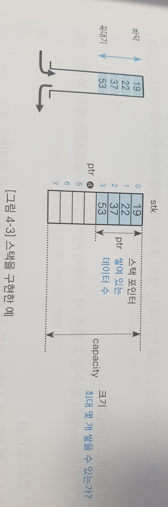
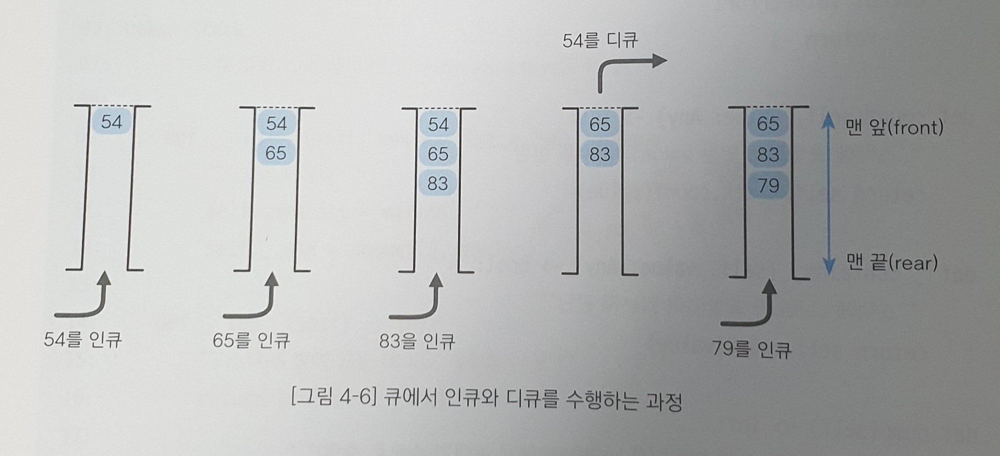
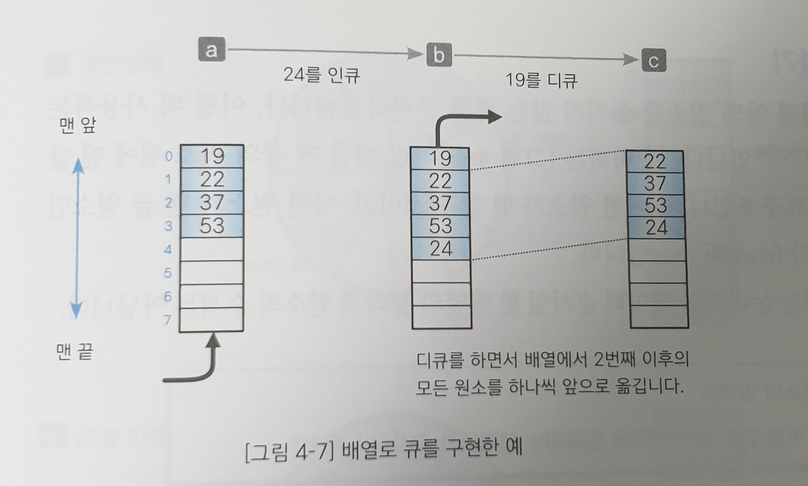
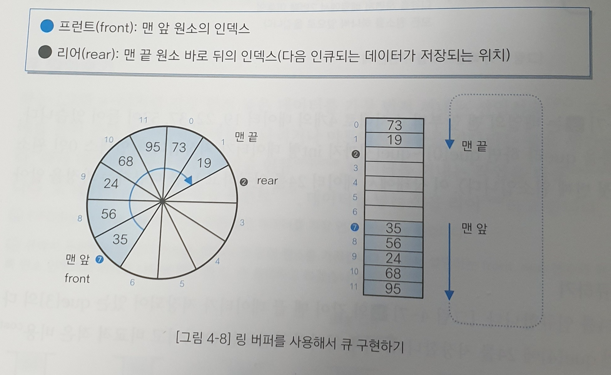
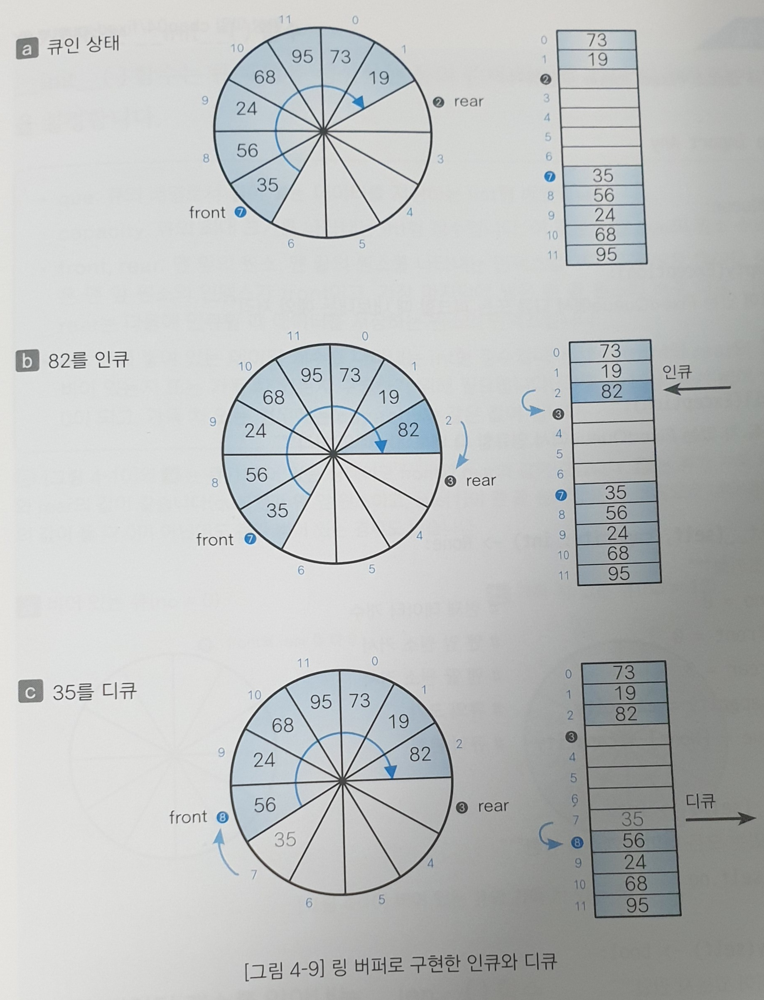
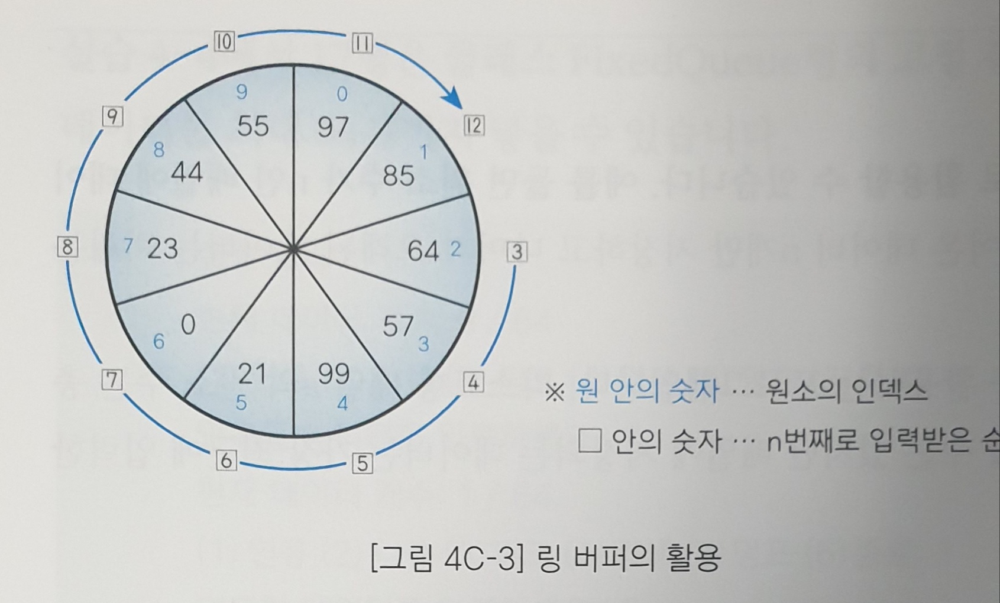

# 4. 스택과 큐

## 04-1. 스택이란?

스택(stack)은 데이터를 임시 저장할 때 사용하는 자료구조로, 데이터의 입력과 출력 순서는 후입선출(LIFO) 방식이다. 가장 마지막에 넣은 데이터를 가장 먼저 꺼낸다.

스택에 데이터를 넣는 작업을 **푸시**라고 하고, 스택에서 데이터를 꺼내는 작업을 **팝**이라고 한다.  접시를 겹쳐 쌓는 것처럼 데이터를 넣곡 꺼내는 작업을 맨 위부터 수행하여, 푸시하고 팝하는 맨 윗부분을 꼭대기(top)라고 하고, 아랫부분을 바닥(bottom)이라고 한다.

**스택의 예시**

```Korean
5를 푸시
	5
	
7을 푸시
	7
	5
	
6을 푸시
	6
	7
	5
	
    팝 ---> 6이 꺼내짐
	7
	5

3을 푸시
	3
	7
	5
	
	팝 ---> 3이 꺼내짐
	7
	5
```


**스택 구현하기**

크기가 결정된 고정 길이 스택을 만들어 보자.  

- 스택 배열: stk
  - 푸시한 데이터를 저장하는 스택 본체인 list형 배열이다. 인덱스가 0인 원소를 스택의 바닥이라고 하며, 따라서 가장 먼저 푸시하여 데이터를 저장하는 곳은 stk[0]이다.
- 스택 크기: capacity
  - 스택의 최대 크기를 나타내는 int형 정수이다. 이 값은 배열 stk의 원소 수인 len(stk)와 같다.
- 스택 포인터: ptr
  - 스택에 쌓여 있는 데이터의 개수를 나타내는 정숫값을 스택 포인터라고 한다. 물론 스택이 비어 있으면 ptr은 0이 되고, 가득 차 있으면 len(stk)가 된다. 



위 그림은 크기가 8인 스택에 4개의 데이터를 푸시한 상태로, 가장 먼저 푸시한 데이터는 stk[0]인 19이고, 가장 마지막에 푸시한 데이터는 stk[ptr-1]인 53이다.

다음 코드는 고정 길이 스택을 구현하는 FixedStack 클래스이다. 

```python
from typing import Any

class FixedStack:
    """고정 길이 스택 클래스"""

    class Empty(Exception):
        """비어 있는 FixedStack에 pop 또는 peek를 호출할 때 내보내는 예외 처리"""
        pass

    class Full(Exception):
        """가득 찬 FixedStack에 push를 호출할 때 내보내는 예외 처리"""
        pass

    def __init__(self, capacity: int = 256) -> None:
        """초기화"""
        self.stk = [None] * capacity  # 스택 본체
        self.capacity = capacity      # 스택의 크기
        self.ptr = 0                  # 스택 포인터

    def __len__(self) -> int:
        """스택에 쌓여있는 데이터 개수를 반환"""
        return self.ptr

    def is_empty(self) -> bool:
        """스택이 비어 있는가?"""
        return self.ptr <= 0

    def is_full(self) -> bool:
        """스택은 가득 찼는가?"""
        return self.ptr >= self.capacity
```

- 예외 처리 클래스 Empty
  - 스택을 실제로 사용할 때 pop함수 또는 peek 함수를 호출하였는데 스택이 비어 있으면 내보내는 예외 처리
- 예외 처리 클래스 Full
  - push 함수를 호출할 때 스택이 가득 차 있으면 내보내는 예외 처리
- 초기화하는 __ init()__ 함수
  - __ init__() 함수는 스택 배열을 생성하는 등의 준비 작업을 수행한다. 매개변수 capacity로 전달받은 값을 스택의 크기를 나타내는 필드인 capacity로 복사하여 원소 수가 capacity이고 모든 원소가 None인 리스트형 stk를 생성한다. 이때 스택이 비어 있으므로 스택 포인터 ptr의 값을 0으로 한다.
- 쌓여 있는 데이터 개수를 알아내는 __ len__() 함수
  - 스택에 쌓여 있는 데이터 개수를 반환한다. (스택 포인터 ptr의 값을 그대로 반환)

- 스택이 비어 있는지를 판단하는 is_empty() 함수
  - is_empty() 함수는 데이터가 하나도 쌓여 있지 않은 상태, 즉 스택이 비어 있는지 판단한다. 스택이 비어 있으면 True, 그렇지 않으면 False를 반환
- 스택이 가득 차 있는지를 판단하는 is_full() 함수
  - is_full() 함수는 더 이상 데이터를 푸시할 수 없는 상태, 즉 스택이 가득 차 있는지 판단한다. 스택이 가득 차 있으면 True를, 그렇지 않으면 False를 반환한다.

그 다음 진행할 것은 다음과 같다.

```python
    def push(self, value: Any) -> None:
        """스택에 value를 푸시"""
        if self.is_full():              # 스택이 가득 참
            raise FixedStack.Full
        self.stk[self.ptr] = value
        self.ptr += 1

    def pop(self) -> Any:
        """스택에서 데이터를 팝(꼭대기 데이터를 꺼냄)"""
        if self.is_empty():             # 스택이 비어 있음
             raise FixedStack.Empty
        self.ptr -= 1
        return self.stk[self.ptr]

    def peek(self) -> Any:
        """스택에서 데이터를 피크(꼭대기 데이터를 들여다 봄)"""
        if self.is_empty():             # 스택이 비어 있음
            raise FixedStack.Empty
        return self.stk[self.ptr - 1]

    def clear(self) -> None:
        """스택을 비움(모든 데이터를 삭제)"""
        self.ptr = 0
```

- 데이터를 푸시하는 push() 함수
  - 푸시 함수는 스택에 데이터를 추가한다. 스택이 꽉 차서 더 이상 푸시할 수 없는 경우에는 앞서 알아본 예외 처리 클래스 Full을 통해 예외 처리를 내보낸다. 스택이 가득 차 있지 않으면 stk[ptr]에 전달받은 value를 저장하고 ptr을 1 증가시킨다.
- 데이터를 팝하는 pop() 함수
  - 팝 함수는 스택의 꼭대기에서 데이터를 꺼내서 그 값을 반환한다. 스택이 비어 팝 할수 없는 경우에는 앞서 알아본 Empty 예외처리 클래스를 통해 예외처리한다. 스택이 비어있지 않으면 스택 포인터 ptr의 값을 1 감소시키고 stk[ptr]에 저장된 값을 반환한다.
- 데이터를 들여다보는 peek() 함수
  - peek 함수는 스택의 꼭대기 데이터(다음에 팝하는 데이터)를 들여다본다. 스택이 비어있는 경우에는 Empty 예외처리한다. 스택이 비어있지 않으면 꼭대기 원소 stk[ptr-1]을 반환한다. 스택 포인터 ptr은 변하지 않는다.
- 스택의 모든 데이터를 삭제하는 clear() 함수
  - 클리어 함수는 스택에 쌓여 있는 데이터를 모두 삭제하여 빈 스택을 만든다. **스택 포인터 ptr의 값만 0으로 하면 끝난다. **
  - 스택에서 푸시나 팝 등 모든 작업은 스택 포인터 ptr을 바탕으로 이루어지기 때문에 스택의 배열 원솟값을 변경할 필요가 없다.

다음 코드는 아래와 같다.

```python
    def find(self, value: Any) -> Any:
        """스택에서 value를 찾아 첨자(없으면 -1)를 반환"""
        for i in range(self.ptr - 1, -1, -1):  # 꼭대기 쪽부터 선형 검색, ptr-1 = 꼭대기, 0까지 -1 방향으로!
            if self.stk[i] == value:
                return i  # 검색 성공
        return -1         # 검색 실패

    def count(self, value: Any) -> bool:
        """스택에 포함되어있는 value의 개수를 반환"""
        c = 0
        for i in range(self.ptr):  # 바닥 쪽부터 선형 검색
            if self.stk[i] == value:
                c += 1             # 들어 있음
        return c

    def __contains__(self, value: Any) -> bool:
        """스택에 value가 있는가?"""
        return self.count(value)

    def dump(self) -> None:
        """덤프(스택 안의 모든 데이터를 바닥부터 꼭대기 순으로 출력)"""
        if self.is_empty():  # 스택이 비어 있음
            print('스택이 비어 있습니다.')
        else:
            print(self.stk[:self.ptr])
```

- 데이터를 검색하는 find() 함수
  - 파인트 함수는 스택 본체의 배열 stk 안에 value와 값이 같은 데이터가 포함되어 있는지 확인하고, 포함되어 있다면 배열의 어디에 들어 있는지 검색한다.
  - 검색은 꼭대기부터 바닥 쪽으로 선형 검색한다. (인덱스 큰 쪽 -> 작은 쪽)검색에 성공하면 발견한 원소의 인덱스를 반환하고 실패하면 -1을 반환한다.
- 데이터 개수를 세는 count() 함수
  - 카운트 함수는 스택에 쌓여 있는 데이터의 개수를 구하여 반환한다.
- 데이터가 포함되어 있는지 판단하는 __ contains__() 함수
  - 컨테인 함수는 스택에 데이터(value)가 있는지 판단한다. 있으면 True, 그렇지 않으면 False를 반환한다. 예를 들어 스택 s에 데이터 x가 포함되어 있는지 판단은 s.__ contain__(x) 뿐만 아니라 멤버십 판단 연산자인 in을 사용하여 x in s로 수행할 수도 있다.
- 스택의 모든 데이터를 출력하는 dump() 함수
  - 덤프 함수는 스택에 쌓여 있는 ptr개의 모든 데이터를 바닥부터 꼭대기까지 순서대로 출력한다. 스택이 비어 있으면 '스택이 비어 있습니다.'를 출력한다.


---

**`__len__()` 함수와 `__contain__()` 함수 알아보기**

- 파이썬에서 언더스코어가 2개 붙은 함수(던더 함수)는 특별한 의미가 있다.
- 클래스에 `__len__()` 함수(던더 렌 던더, 던더 렌)를 정의하면 클래스형의 인스턴스를 `__len__()`함수에 전달할 수 있다. 예를 들어 클래스형의 인스턴스 obj에 대한 `__len__()` 함수를 호출하는 `obj.__len__()`를 간단히 len(obj)로 작성할 수 있다.
- 클래스에 `__contains__()`함수를 정의하면 클래스형의 인스턴스에 멤버십 판단 연산자인 in을 적용할 수 있다. 예를 들어 클래스형의 인스턴스 obj에 대한 `__contains__()`함수를 호출하는 `obj.__contains__(x)`를 간단히 x in obj 로 작성할 수 있다.

참고자료: [매직 메소드](https://wikidocs.net/83755)

​				 [매직 메소드 사용법](https://zzsza.github.io/development/2020/07/05/python-magic-method/)

클래스에서 특정 동작을 할 수 있도록 만들고 싶을 때 사용!

---

**스택 프로그램 만들기**

```python
from enum import Enum
from fixed_stack import FixedStack

Menu = Enum('Menu', ['푸시', '팝', '피크', '검색', '덤프', '종료'])

def select_menu() -> Menu:
    """메뉴 선택"""
    s = [f'({m.value}){m.name}' for m in Menu] #(1)푸시, (2)팝, (3)피크 ... 이런 식으로 s에 저장됨
    while True:
        print(*s, sep = '   ', end='')   #(1)푸시    (2)팝    (3)피크    ~   (6)종료 ... 이런 식으로 출력
        n = int(input(': '))
        if 1 <= n <= len(Menu):
            return Menu(n)

s = FixedStack(64)  # 최대 64개를 푸시할 수 있는 스택

while True:
    print(f'현재 데이터 개수: {len(s)} / {s.capacity}')
    menu = select_menu()  # 메뉴 선택
    
    if menu == Menu.푸시:  # 푸시
        x = int(input('데이터를 입력하세요.: '))
        try:
            s.push(x)
        except FixedStack.Full:
            print('스택이 가득 차 있습니다.')

    elif menu == Menu.팝:  # 팝
        try:
            x = s.pop()
            print(f'팝한 데이터는 {x}입니다.')
        except FixedStack.Empty:
            print('스택이 비어 있습니다.')

    elif menu == Menu.피크:  # 피크
        try:
            x = s.peek()
            print(f'피크한 데이터는 {x}입니다.')
        except FixedStack.Empty:
            print('스택이 비어 있습니다.')

    elif menu == Menu.검색:  # 검색
        x = int(input('검색할 값을 입력하세요.: '))
        if x in s:              #FixedStack class에 __ contains __ 를 추가하여 이용할 수 있는 기능! 
            print(f'{s.count(x)}개 포함되고, 맨 앞의 위치는 {s.find(x)}입니다.')
        else:
            print('검색값을 찾을 수 없습니다.')

    elif menu == Menu.덤프:  # 덤프
        s.dump()

    else:
        break
```

실행 결과

```
$ python fixed_stack_test.py
현재 데이터 개수: 0 / 64
(1)푸시   (2)팝   (3)피크   (4)검색   (5)덤프   (6)종료: 1
데이터를 입력하세요.: 1
현재 데이터 개수: 1 / 64
(1)푸시   (2)팝   (3)피크   (4)검색   (5)덤프   (6)종료: 1
데이터를 입력하세요.: 2
현재 데이터 개수: 2 / 64
(1)푸시   (2)팝   (3)피크   (4)검색   (5)덤프   (6)종료: 1
데이터를 입력하세요.: 3
현재 데이터 개수: 3 / 64
(1)푸시   (2)팝   (3)피크   (4)검색   (5)덤프   (6)종료: 1
데이터를 입력하세요.: 1
현재 데이터 개수: 4 / 64
(1)푸시   (2)팝   (3)피크   (4)검색   (5)덤프   (6)종료: 1
데이터를 입력하세요.: 5
현재 데이터 개수: 5 / 64
(1)푸시   (2)팝   (3)피크   (4)검색   (5)덤프   (6)종료: 4
검색할 값을 입력하세요.: 1
2개 포함되고, 맨 앞의 위치는 3입니다.
현재 데이터 개수: 5 / 64
(1)푸시   (2)팝   (3)피크   (4)검색   (5)덤프   (6)종료: 3
피크한 데이터는 5입니다.
현재 데이터 개수: 5 / 64
(1)푸시   (2)팝   (3)피크   (4)검색   (5)덤프   (6)종료: 2
팝한 데이터는 5입니다.
현재 데이터 개수: 4 / 64
(1)푸시   (2)팝   (3)피크   (4)검색   (5)덤프   (6)종료: 2
팝한 데이터는 1입니다.
현재 데이터 개수: 3 / 64
(1)푸시   (2)팝   (3)피크   (4)검색   (5)덤프   (6)종료: 5
[1, 2, 3]
현재 데이터 개수: 3 / 64
(1)푸시   (2)팝   (3)피크   (4)검색   (5)덤프   (6)종료: 6
```


**collections.deque로 스택 구현하기**

파이썬에는 딕셔너리, 리스트, 집합, 튜플 등의 내장 컨테이너가 있다. 이 외에도 여러 컨테이너가 collections 모듈로 제공되는데, 주요 컨테이너에 namedtuple(), deque, ChainMap, Counter, OrderedDict, defaultdict, UserDict, UserList, UserString 등이 있다. 이 가운데 deque 모듈을 사용하면 스택을 간단하게 구현할 수 있다. collection.deque는 맨 앞과 맨 끝 양쪽에서 원소를 추가, 삭제하는 자료구조인 덱(deque, double ended queue)을 구현하는 컨테이너이고, 주요 속성과 함수는 다음과 같다.

| 속성과 함수                     | 설명                                                         |
| ------------------------------- | ------------------------------------------------------------ |
| maxlen 속성                     | 덱의 최대 크기를 나타내는 속성으로 읽기 전용이다. 크기 제한이 없으면 None을 반환 |
| append(x) 함수                  | 덱의 맨 끝(오른쪽)에 x를 추가한다.                           |
| appendleft(x) 함수              | 덱의 맨 앞(왼쪽)에 x를 추가한다.                             |
| clear() 함수                    | 덱의 모든 원소를 삭제하고 크기를 0으로 한다.                 |
| copy() 함수                     | 덱의 얕은 복사를 한다.                                       |
| count(x) 함수                   | 덱 안에 있는 x와 같은 원소의 개수를 계산한다.                |
| extend(iterable) 함수           | 순차 반복 인수 iterable에서 가져온 원소를 덱의 맨 끝(오른쪽)에 추가하여 확장한다. |
| extendleft(iterable) 함수       | 순차 반복 인수 iterable에서 가져온 원소를 덱의 맨 앞(왼쪽)에 추가하여 확장한다. |
| index(x[, start [, stop]]) 함수 | 덱 안에 있는(인덱스 start부터 stop까지 양 끝을 포함한 범위) x 가운데 가장 앞쪽에 있는 원소의 위치를 반환한다. x가 없는 경우는 ValueError를 내보낸다. |
| insert(i, x) 함수               | x를 덱의 i 위치에 삽입한다. 이때 크기에 제한이 있는 덱일 경우 maxlen을 초과한 삽입은 indexError를 내보낸다. |
| pop() 함수                      | 덱의 맨 끝(오른쪽)에 있는 원소를 1개 삭제하고 그 원소를 반환한다. 원소가 하나도 없는 경우에는 IndexError를 내보낸다. |
| popleft() 함수                  | 덱의 맨 앞(왼쪽)에 있는 원소를 1개 삭제하고 그 원소를 반환한다. 원소가 하나도 없는 경우에는 IndexError를 내보낸다. |
| remove(value) 함수              | value의 첫 번째 항목을 삭제한다. 원소가 없는 경우에는 ValueError를 내보낸다. |
| reverse() 함수                  | 덱의 원소를 역순으로 재정렬하고 None을 반환한다.             |
| rotate(n=1) 함수                | 덱의 모든 원소를 n값만큼 오른쪽으로 밀어낸다. n이 음수라면 왼쪽으로 밀어낸다. |

이 외에도 이터레이션과 pickle, len(d), reversed(d), copy.copy(d), copy.deepcopy(d), in 연산자로 멤버십 판단, d[0] 등의 형식에서 인덱스에 의한 참조를 지원한다.

다음 코드는 이러한 collections.deque를 통해 고정 길이 스택을 구현한 것이다.

```python
from typing import Any
from collections import deque

class Stack:
    """고정 길이 스택 클래스(collections.deque를 사용)"""

    def __init__(self, maxlen: int = 256) -> None:
        """초기화 선언"""
        self.capacity = maxlen
        self.__stk = deque([], maxlen) #덱을 이용해서 비어있고 최대 길이가 maxlen인 스택 생성
        					       Ex) #deque([1, 2, 3], 2) -> deque([2, 3]) #뒤부터 2개를 스택에 넣음
        							   #deque([1, 2, 3, 4], 3) -> deque([2, 3, 4]) #뒤부터 3개를 스택에 넣음
        							   #deque([1, 2, 3, 4], 6) -> deque([1, 2, 3, 4]) #4개를 채워 2자리 남음

    def __len__(self) -> int:   #__len__를 사용함으로써 Stack class에서는 len() 형식을 사용 가능!
        """스택에 쌓여있는 데이터 개수를 반환"""
        return len(self.__stk)  #deque type(class)에서는 원래 len을 사용할 수 있음을 이용.

    def is_empty(self) -> bool:
        """스택이 비어 있는지 판단"""
        return not self.__stk

    def is_full(self) -> bool:
        """스택이 가득 찼는지 판단"""
        return len(self.__stk) == self.__stk.maxlen

    def push(self, value: Any) -> None:
        """스택에 value를 푸시"""
        self.__stk.append(value)

    def pop(self) -> Any:
        """스택에서 데이터를 팝"""
        return self.__stk.pop()

    def peek(self) -> Any:
        """스택에서 데이터를 피크"""
        return self.__stk[-1]

    def clear(self) -> None:
        """스택을 비웁니다"""
        self.__stk.clear()

    def find(self, value: Any) -> Any:
        """스택에서 value를 찾아 인덱스(없으면 -1)를 반환"""
        try:
            return self.__stk.index(value)
        except ValueError:
            return -1

    def count(self, value: Any) -> int:
        """스택에 포함된 value의 개수를 반환"""
        return self.__stk.count(value)

    def __contains__(self, value: Any) -> bool:
        """스택에 value가 포함되어 있는지 판단"""
        return self.count(value)

    def dump(self) -> int:
        """스택 안에 있는 모든 데이터를 나열"""
        print(list(self.__stk))
```

deque type에서 이용할 수 있는 여러 함수들을 이용하여 한결 간결하게 원하는 기능을 구현하였다.

**deque를 이용한 스택 프로그램 만들기** = 그냥 FixedStack을 이용했을 때와 똑같음. 기능이 같기 때문에! 달라진건 이름뿐.

```python
from enum import Enum
from stack import Stack

Menu = Enum('Menu', ['푸시', '팝', '피크', '검색', '덤프', '종료'])

def select_menu() -> Menu:
    """메뉴 선택"""
    s = [f'({m.value}){m.name}' for m in Menu]
    while True:
        print(*s, sep='  ', end='')
        n = int(input('：'))
        if 1 <= n <= len(Menu):
            return Menu(n)

s = Stack(64)  # 최대 64 개를 푸시할 수 있는 스택

while True:
    print(f'현재 데이터 개수：{len(s)} / {s.capacity}')
    menu = select_menu()  # 메뉴 선택

    if menu == Menu.푸시:  # 푸시
        x = int(input('데이터：'))
        try:
            s.push(x)
        except IndexError:
            print('스택이 가득 찼습니다.')

    elif menu == Menu.팝:  # 팝
        try:
            x = s.pop()
            print(f'팝한 데이터는 {x}입니다.')
        except IndexError:
           print('스택이 비어 있습니다.')

    elif menu == Menu.피크:  # 피크
        try:
            x = s.peek()
            print(f'피크한 데이터는 {x}입니다.')
        except IndexError:
           print('스택이 비어 있습니다.')

    elif menu == Menu.검색:  # 검색
        x = int(input('검색 값을 입력하세요：'))
        if x in s:
            print(f'{s.count(x)} 개를 포함하고, 맨 앞쪽의 위치는 {s.find(x)}입니다.')
        else:
            print('검색 값은 포함되어 있지 않습니다.')
            
    elif menu == Menu.덤프:  # 덤프
        s.dump()

    else:
        break
```


## 04-2 큐란?

큐(queue)는 스택과 같이 데이터를 임시 저장하는 자료구조이다. 하지만 스택처럼 가장 나중에 넣은 데이터를 가장 먼저 꺼내지 않는다.

**큐 알아보기**

큐는 가장 먼저 넣은 데이터를 가장 먼저 꺼내는 선입선출(FIFO, first in first out) 구조이다.

ex) 마트에서 계산을 기다리는 줄, 은행 창구에서 차례를 기다리는 일

큐에 데이터를 추가하는 작업을 인큐(enqueue), 데이터를 꺼내는 작업을 디큐(dequeue)라고 한다. 

데이터를 꺼내는 쪽을 프런트(front), 데이터를 넣는 쪽을 리어(rear)라고 한다.




**배열로 큐 구현하기**

큐는 배열로 구현할 수 있다. 아래 그림은 네 개의 데이터가 들어 있는 큐에서 24를 인큐하고 19를 디큐하는 과정을 나타낸 그림이다.



que[0] ~ que[3] 까지 int형 데이터 19, 22, 37, 53이 저장되어 있다.

- 24를 인큐하면 que[4]에 24를 저장하고, 이 때 처리의 복잡도는 O(1)로 비교적 적은 비용으로 구현 가능하다.
- 19를 디큐하면 que[0]에 저장되어 있는 19를 꺼내면서 2번째 이후의 모든 원소를 앞쪽으로 옮겨야 한다. 이 때 처리의 복잡도는 O(n)으로 데이터를 꺼낼 때마다 이런 처리 작업을 수행해야 한다면 프로그램의 효율성을 기대할 수 없다.

**(참고)인큐할 때는 데이터에 우선순위를 부여하여 추가하고, 디큐할 때 우선순위가 가장 높은 데이터를 꺼내는 우선순위 큐(priority queue)라는 것도 있다.**


**링 버퍼로 큐 구현하기**

디큐할 때 배열 안의 원소를 옮기지 않는 큐를 구현할 수 있다! 이 때 사용하는 자료구조를 링 버퍼(ring buffer)라고 하며, 배열 맨 끝의 원소 뒤에 맨 앞의 원소가 연결되는 자료구조이다. 어떤 원소가 맨 앞 원소이고, 어떤 원소가 맨 끝 원소인지 식별하는 변수가 각각 front와 rear이다.



인큐와 디큐를 수행하면 논리적인 데이터 순서인 front와 rear의 값만 변화하게 된다.

82를 인큐하고 35를 디큐하는 다음 과정을 통해 이해해보자.



- 상태a에서 front는 que[7], rear는 rear는 맨 마지막 원소의 다음 인덱스인 que[2]에 위치한다.
- 여기에 82를 인큐하면 b와 같이 que[2]에 82가 들어가고 rear는 다음 인덱스인 que[3]으로 이동한다.
- 이제 35를 디큐하면 c와 같이 front인 que[7]의 원소를 꺼내고 front의 위치가 다음 인덱스인 que[8]로 이동한다.

이렇게 링 버퍼로 큐를 구현하면 원소를 옮길 필요 없이 front와 rear값만 업데이트하면 되기 때문에 모든 처리의 복잡도가 O(1)이 되어 보다 효율적이게 된다.


이제 링 버퍼를 이용한 큐를 어떻게 구현하는지 코드를 통해 알아보자.

```python
from typing import Any

class FixedQueue:

    class Empty(Exception):
        """비어 있는 FixedQueue에 대해 deque 또는 peek를 호출할 때 내보내는 예외처리"""
        pass

    class Full(Exception):
        """가득 찬 FixedQueue에 enque를 호출할 때 내보내는 예외처리"""
        pass

    def __init__(self, capacity: int) -> None:
        """초기화 선언"""
        self.no = 0     # 현재 데이터 개수
        self.front = 0  # 맨앞 원소 커서, 맨 앞에 원소의 인덱스가 될 것
        self.rear = 0   # 맨끝 원소 커서, 맨 뒤 원소의 바로 다음 인덱스가 될 것
        self.capacity = capacity      # 큐의 크기
        self.que = [None] * capacity  # 큐의 본체, 데이터를 저장하는 list형 배열

    def __len__(self) -> int:
        """큐에 있는 모든 데이터 개수를 반환"""  #class FixedQueue에서 len()을 사용할 수 있게됨
        return self.no

    def is_empty(self) -> bool:
        """큐가 비어 있는지 판단"""
        return self.no <= 0                  #True면 큐가 비어 있음

    def is_full(self) -> bool:
        """큐가 가득 찼는지 판단"""
        return self.no >= self.capacity      #True면 큐가 가득 차 있음

    def enque(self, x: Any) -> None:
        """데이터 x를 인큐"""
        if self.is_full():
            raise FixedQueue.Full  # 큐가 가득 찬 경우 예외처리를 발생
        self.que[self.rear] = x    # 맨 끝에 원소를 추가!
        self.rear += 1
        self.no += 1
        if self.rear == self.capacity:  #끝(capacity-1)에 있던 rear가 인큐로 인해 한칸 더 밀리면!
            self.rear = 0               #원점으로 돌아간다. (인덱스가 capacity인 경우는 없다. 대신 0으로 돌아가야함)

    def deque(self) -> Any:
        """데이터를 디큐합니다"""
        if self.is_empty():
            raise FixedQueue.Empty  # 큐가 비어 있는 경우 예외처리를 발생
        x = self.que[self.front]
        self.front += 1
        self.no -= 1
        if self.front == self.capacity: #끝(capacity-1)에 있던 front가 디큐로 인해 한칸 더 밀리면!
            self.front = 0              #원점으로 돌아간다.
        return x

    def peek(self) -> Any:
        """데이터를 피크합니다(맨 앞 데이터를 들여다 봄)"""
        if self.is_empty():
            raise FixedQueue.Empty  # 큐가 비어 있으면 예외처리를 발생
        return self.que[self.front]

    def find(self, value: Any) -> Any:
        """큐에서 value를 찾아 인덱스를 반환하고 없으면 -1을 반환합니다"""
        for i in range(self.no):
            idx = (i + self.front) % self.capacity
            if self.que[idx] == value:  # 검색 성공
                return idx
        return -1  # 검색 실패

    def count(self, value: Any) -> bool:
        """큐에 포함되어 있는 value의 개수를 반환합니다"""
        c = 0
        for i in range(self.no):  # 큐 데이터를 선형 검색
            idx = (i + self.front) % self.capacity  #i+self.front가 capacity보다 커질 경우 0, 1, 2 ...
            if self.que[idx] == value:  # 검색 성공
                c += 1  # 들어있음
        return c

    def __contains__(self, value: Any) -> bool:  #이걸 통해 x in classname 같은 형태를 사용 가능
        """큐에 value가 포함되어 있는지 판단합니다"""
        return self.count(value)

    def clear(self) -> None:
        """큐의 모든 데이터를 비웁니다"""
        self.no = self.front = self.rear = 0

    def dump(self) -> None:
        """모든 데이터를 맨 앞에서 맨 끝 순서로 출력합니다"""
        if self.is_empty():  # 큐가 비어 있으면 예외처리를 발생
            print('큐가 비어 있습니다.')
        else:
            for i in range(self.no):
                print(self.que[(i + self.front) % self.capacity], end=' ')
            print()
```


지금까지 살펴본 디큐(deque)말고 앞에서 알아본 덱(deque)은 2개의 포인터를 이용하여 양쪽에서 삭제, 삽입을 할 수 있으며, 큐와 스택을 합친 형태라고 생각할 수 있다.


**링 버퍼로 큐 프로그램 만들기**

```python
rom enum import Enum
from fixed_queue import FixedQueue

Menu = Enum('Menu', ['인큐', '디큐', '피크', '검색', '덤프', '종료'])

def select_menu() -> Menu:
    """메뉴 선택"""
    s = [f'({m.value}){m.name}' for m in Menu]
    while True:
        print(*s, sep='   ', end='')
        n = int(input(': '))
        if 1 <= n <= len(Menu):
            return Menu(n)

q = FixedQueue(64)  # 최대 64개를 인큐할 수 있는 큐 생성(고정 길이)

while True:
    print(f'현재 데이터 개수: {len(q)} / {q.capacity}')
    menu = select_menu()   # 메뉴 선택

    if menu == Menu.인큐:  # 인큐
        x = int(input('인큐할 데이터를 입력하세요.: '))
        try:
            q.enque(x)
        except FixedQueue.Full:
            print('큐가 가득 찼습니다.')

    elif menu == Menu.디큐:  # 디큐
        try:
            x = q.deque()
            print(f'디큐한 데이터는 {x}입니다.')
        except FixedQueue.Empty:
            print('큐가 비어 있습니다.')

    elif menu == Menu.피크:  # 피크
        try:
            x = q.peek()
            print(f'피크한 데이터는 {x}입니다.')
        except FixedQueue.Empty:
            print('큐가 비었습니다.')

    elif menu == Menu.검색:  # 검색
        x = int(input('검색할 값을 입력하세요.: '))
        if x in q:
            print(f'{q.count(x)}개 포함되고, 맨 앞의 위치는 {q.find(x)}입니다.')
        else:
            print('검색값을 찾을 수 없습니다.')

    elif menu == Menu.덤프:  # 덤프
        q.dump()
    else:
        break
```


---

**링 버퍼의 활용**

링 버퍼는 오래된 데이터를 버리는 용도로 활용할 수 있다. 그 예로 가장 최근에 들어온 데이터 n개만 저장하고 나머지 오래된 데이터는 버리는 경우를 들 수 있다. 배열의 총 길이가 10일 때 12개의 정수를 입력받는다면 최근에 입력받은 10개만 남고 2개는 사라질 것이다.

```python
n = int(input('정수를 몇 개 저장할까요? : '))
a = [None] * n  # 입력 받은 값을 저장하는 배열

cnt = 0         # 입력 받은 개수
while True:
    a[cnt % n] = int(input((f'{cnt + 1} 번째 정수를 입력하세요.: ')))
    cnt += 1

    retry = input(f'계속 할까요?(Y ... Yes / N ... No) : ')
    if retry in {'N', 'n'}:
        break

i = cnt - n
if i < 0: i = 0

while i < cnt:
    print(f'{i + 1}번째 = {a[i % n]}')
    i += 1
```

```python
#천천히 확인해보며 이해해보자
배열의 길이 n = 10이라고 하고, 12개의 정수를 입력한다고 하자.
a[0 % 10] = int(input(f'{0 + 1} 번째 정수를 입력하세요.:')) #cnt = 1
a[1 % 10] = int(input(f'{1 + 1} 번째 정수를 입력하세요.:')) #cnt = 2
a[2 % 10] = int(input(f'{2 + 1} 번째 정수를 입력하세요.:'))
a[3 % 10] = int(input(f'{3 + 1} 번째 정수를 입력하세요.:'))

                      ...
    
a[9 % 10] = int(input(f'{9 + 1} 번째 정수를 입력하세요.:')) #cnt = 10
a[10 % 10] = int(input(f'{10 + 1} 번째 정수를 입력하세요.:'))  #0에 저장
a[11 % 10] = int(input(f'{11 + 1} 번째 정수를 입력하세요.:'))  #1에 저장, cnt = 12

i = cnt - n = 12 - 10 = 2
if i < 0: i = 0  # 들어간 숫자가 전체 배열 길이보다 작은 경우 i = 0부터 시작함.
                 # 전체 배열 길이보다 들어간 숫자가 많은 경우 0, 1, 2, 3, 4, 5, 6, 7, 8, 9, 10, 11 => 0, 12 => 1
                 # 앞의 0, 1은 11, 12번째 들어온 정수로 대체되고, 따라서 시작 지점은 i = 2 부터.
while i < cnt(= 12):
    print(f'{i + 1 = 3}번째 = {a[i % n = 2 % 10]}) 이런 꼴이니까 이 while문에서 얻을 수 있는 결과는
3번째 = idx 2에 있는 수
4번째 = idx 3에 있는 수
5번째 = idx 4에 있는 수
       ...
10번째 = idx 9에 있는 수
11번째 = idx 0에 있는 수
12번째 = idx 1에 있는 수
```

참고 사진




