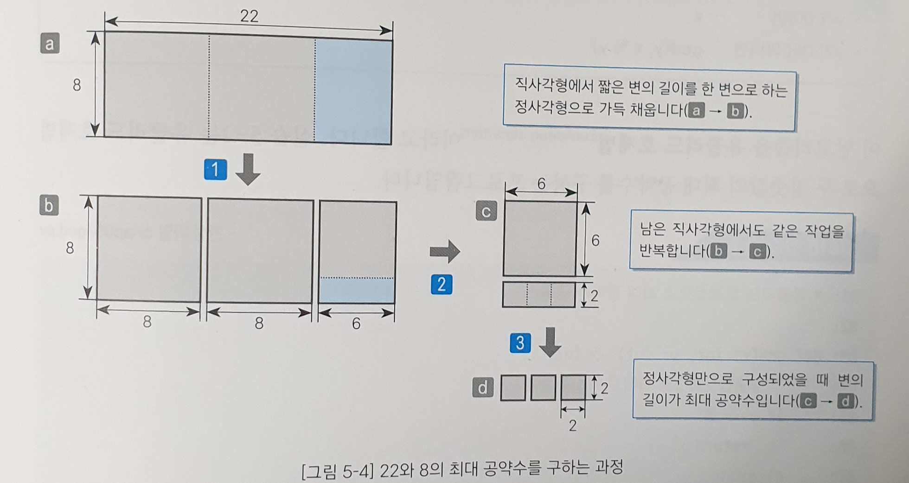
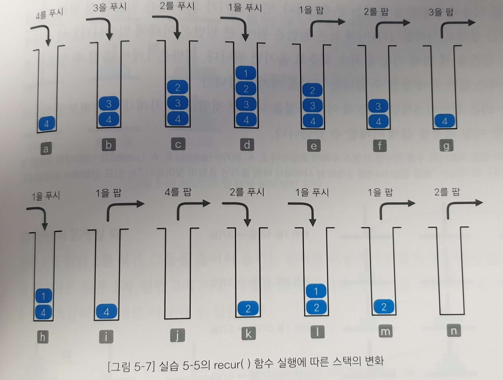
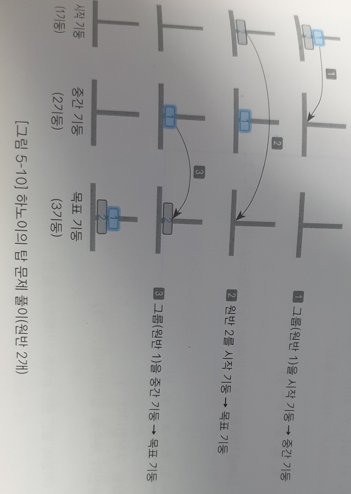
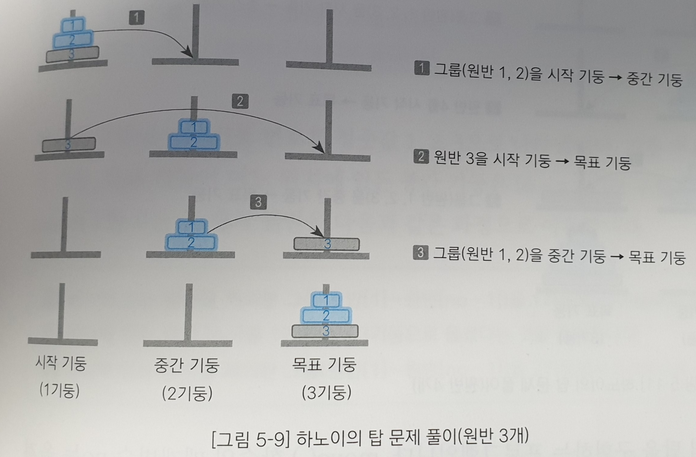
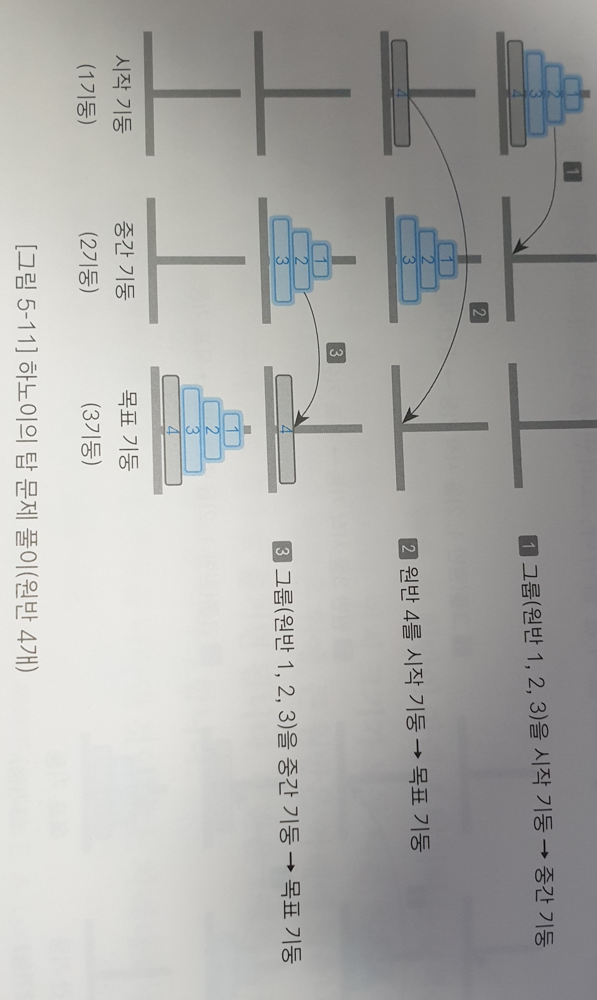

# 05. 재귀 알고리즘

### 05-1. 재귀 알고리즘의 기본

**재귀**: 어떠한 이벤트에서 자기 자신을 포함하고 다시 자기 자신을 사용하여 정의되는 경우!

ex) 자연수의 정의

- 1은 자연수입니다.
- 어떤 자연수의 바로 다음 수도 자연수입니다.

**팩토리얼 알아보기**

- 0! = 1
- n > 0 이면 n! = n * (n-1)!

ex) 10! = 10 * 9! = 10 * 9 * 8! =~

```python
#양의 정수 n의 팩토리얼 구하기

def factorial(n: int) -> int:
	"""양의 정수 n의 팩토리얼값을 재귀적으로 구함"""
    if n > 0:
        return n * factorial(n-1)
    else:
        return 1
```

> 재귀함수의 동작이 내가 생각했던 것과 조금 달랐다. 재귀함수의 정확한 동작 순서를 팩토리얼 3을 계산하는 과정을 통해 알아보자.
>
> 1) factorial(3) 을 실행하여 3을 인수로 전달
>
> 2) return 3 * factorial(3-1) 에서 2가 factorial의 인수로 전달
>
> 3) return 2 * factorial(2-1) 에서 1이 factorial의 인수로 전달
>
> 4) return 1 * factorial(1-1) 에서 0이 factorial의 인수로 전달
>
> 5) n = 0이므로 return 1과 함께 factorial(0) 함수가 끝남
>
> 6) factorial 0 함수의 결과가 나와서 return 1 * factorial(0)의 결과도 나옴
>
> 7) return 1 * factorial(0)의 결과가 나와서 return 2 * factorial(1)의 결과도 나옴
>
> 8) return 2 * factorial(1)의 결과가 나와서 return 3 * factorial(2)의 결과도 나옴
>
> 이렇게, factorial 2, factorial 1, factorial 0을 순차적으로 계산한 후 함수가 역방향으로 return 되어 최종적인 결과를 얻게 되는 구조였다.
>
> 여기까지 공부한 후 월말평가에서 문제로 나온 십진수를 이진수로 변경하는 재귀 알고리즘을 작성해보았다.
>
> ```python
> def dec_to_bin(n):
> 	if n != 0:
>         n, b = divmod(n, 2)
>         return str(dec_to_bin(n)) + str(b)
>     else:
>         return ''
> ```
>
> n을 2로 나눈 몫이 0이 될때까지 나누고, 그 나머지 값을 뒤에서 앞으로 더해주는 방식으로 쉽게 구현할 수 있었다. 이렇게 쉽게 할 수 있는걸 시험때는 하지 못한게 아쉽다.

---

math.factorial() 함수

파이썬에는 팩토리얼값을 구하는 표준 라이브러리로 math 모듈에서 factorial(x) 함수를 제공한다. 예를 들어 math.factorial(x)는 양의 정수 x의 팩토리얼값을 구해준다.

---


**직접 재귀와 간접 재귀**

직접 재귀: 팩토리얼의 예와 같이 자신과 똑같은 함수를 호출하는 방식을 직접 재귀라고 한다.

간접 재귀: a() 함수가 b() 함수를 호출하고 다시 b() 함수가 a() 함수를 호출하는 구조.


*재귀를 이용한 팩토리얼 계산은 현실적으로는 적절하지 않다. 예제일 뿐!


**유클리드	 호제법**

두 정숫값의 최대 공약수(GCD, greatest common divisor)를 재귀적으로 구하는 방법을 생각해 보자. 2개의 정숫값을 직사각형 두 변의 길이라고 생각하면 두 정숫값의 최대 공약수를 구하는 문제는 다음과 같이 바꿀 수 있다.

-> 직사각형 안을 정사각형 여러 개로 가득 채워 나갈 때, 이렇게 만들 수 있는 정사각형 가운데 가장 작은 정사각형의 변의 길이를 구하라!



위의 그림은 8과 22의 최대 공약수를 구하는 과정을 그림으로 나타낸 것이다.

이를 코드로 표현해보자.

```python
#유클리트 호제법으로 최대 공약수 구하기

def gcd(x: int, y: int) -> int:
    #정숫값 x와 y의 최대 공약수를 반환
    if y == 0:
        return x
    else:
        return gcd(y, x % y)
    
if __name__ == '__main__':
    print('두 정숫값의 최대 공약수를 구합니다.')
    x = int(input('첫 번째 정숫값을 입력하세요.:'))
    y = int(input('두 번째 정숫값을 입력하세요.:'))
    
    print(f'두 정숫값의 최대 공약수는 {gcd(x, y)})입니다')
```

코드만 봐서는 감이 오지 않는다. 22와 8을 대입하는 상황을 생각해보자.

```python
1)
x = 22, y = 8 일 때,
if y == 0:
    return x    #성립x
else:
    return gcd(y, x % y) #성립
y = 8, x % y = 6 이 되었다.

2)
gcd(x, y) = gcd(8, 6) 이 되고,
if y == 0:
    return x    #y = 6으로, 성립x
else:
    return gcd(y, x % y) #성립
y = 6, x % y = 2 이 되었다.

3)
gcd(x, y) = gcd(6, 2) 이 되고,

if y == 0:
    return x    #성립x
else:
    return gcd(y, x % y) #성립
y = 2, x % y = 0 이 되었다.

4)
gcd(x, y) = gcd(2, 0) 이 되고,

if y == 0:
    return x    #성립
else:
    return gcd(y, x % y) #성립x

2가 return된다.
```

그림을 보고 다시 생각해보면, 결국 긴 변을 짧은 변으로 나눈 나머지가 0이 될 때까지 계산을 한 다음, 나머지가 0일 때의 긴 변을 반환하는 것으로 생각할 수 있다.


---

**math.gcd() 함수**

파이썬에서는 최대 공약수를 구하는 표준 라이브러리로 math 모듈에서 gcd() 함수를 제공한다.

math.gcd(a, b) 를 하면 a와 b의 최대공약수를 구해준다.

---


### 05-2 재귀 알고리즘의 분석

재귀 알고리즘을 분석하는 방법에는 **상향식 분석**과 **하향식 분석**이 있다. 우선 하향식 분석은 재귀 알고리즘을 그대로 따라가면서 어떤 호출이 이루어지는지 확인하는 분석 방법이고, 상향식 분석은 하향식 분석과는 반대로 아래쪽부터 쌓아 올리며 분석하는 방법을 말한다. 이 부분은 필요하면 책을 보면 될 것 같아 따로 정리하지 않을 것이다.


#### 재귀 알고리즘의 비재귀적 표현

우선 재귀 알고리즘으로 recur()라는 함수를 표현해보자.

```python
def recur(n: int) -> int:
    '''순수한 재귀 함수 recur의 구현'''
    if n > 0:
        recur(n-1)
        print(n)
        recur(n-2)
        
x = int(input('정숫값을 입력하세요.: '))

recur(x)
```

간단해 보이지만 굉장히 복잡한 과정을 통해 결과를 출력하는 함수가 된다.

예를 들어 recur(4)는

```python
1. recur(3)을 실행한다.
	1-1. recur(2)를 실행한다.
    	1-1-1. recur(1)을 실행한다.
        	1-1-1-1. recur(0)을 실행한다. (결과 없음)
            1-1-1-2. 1을 출력한다.
            1-1-1-3. recur(-1)을 실행한다.(결과 없음)
        1-1-2. 2를 출력한다.
        1-1-3. recur(0)을 실행한다.       (결과 없음)
    1-2. 3을 출력한다.
    1-3. recur(1)을 실행한다.
    	1-3-1. recur(0)을 실행한다.  (결과 없음)
        1-3-2. 1을 출력한다.
        1-3-3. recur(-1)을 실행한다. (결과 없음)
2. 4를 출력한다.
3. recur(2)를 실행한다.
	3-1. recur(1)을 실행한다.
    	3-1-1. recur(0)을 실행한다.  (결과 없음)
        3-1-2. 1을 출력한다.
        3-1-3. recur(-1)을 실행한다. (결과 없음)
    3-2. 2를 출력한다.
    3-3. recur(0)을 실행한다. (결과 없음)
    
실행 결과
1
2
3
1
4
1
2
```

위와 같이 21단계를 거쳐 결과를 출력한다.

이러한 재귀 알고리즘을 비재귀적으로 나타내는 방법을 알아보자.

**꼬리 재귀 제거하기**

```python
def recur(n: int) -> int:
    '''꼬리 재귀를 제거한 recur()함수'''
    while n < 0:
        recur(n - 1)
        print(n)
        n = n - 2
```

while문을 통해 함수 맨 끝에서 실행된 재귀 호출을 쉽게 제거할 수 있다.

반면에 recur(n-1)을 제거하는 것은 쉽지 않다. 4를 출력하기 위해서는 recur(3)을 완전히 실행해야 하고, 그렇게 되면 n값이 바뀌어 4를 출력할 수 없게 되기 때문이다. 이러한 문제는 스택을 사용하여 해결할 수 있다.


```python
# 스택으로 재귀 함수 구현하기(재귀를 제거)
from stack import Stack #4장에서 만든 stack 함수

def recur(n: int) -> int:
    '''재귀를 제거한 recur() 함수'''
    s = Stack(n)
    
    while True:
        if n > 0:
            s.push(n)   #스택에 n값을 푸시
            n = n-1
            continue
        if not s.is_empty(): #스택이 비어 있지 않으면
            n = s.pop()      #저장한 값을 n에 팝
            print(n)
            n = n - 2
            continue
        break
x = int(input('정숫값을 입력하세요.: '))

recur(x)
```

  

실행 과정을 그림으로 살펴보면 위와 같은데, 이걸 생각해낼 수 있을까?


### 05-3 하노이의 탑

하노이의 탑 문제는 크게 보면 세 가지 과정으로 나눌 수 있다.

1) 맨 밑바닥의 원반을 제외한 윗부분을 중간 지점으로 옮긴다.

2) 맨 밑바닥의 원반을 목표 지점으로 옮긴다.

3) 중간 지점에 옮겨놓은 원반을 목표 지점으로 옮긴다.


이 세 가지 과정은 모든 수의 하노이의 탑 문제에서 성립한다. 예를 들어, 2개의 원반을 옮기는 경우, 다음 그림과 같다.




3개의 원반을 옮기는 경우는 다음과 같다.




4개의 원반을 옮기는 경우는 다음과 같다.


따라서 상기한 세 가지 순서를 알고리즘으로 표현하면 다음과 같이 쓸 수 있다.

```python
def move(no: int, x: int, y: int) -> None:
    '''원반 no개를 x기둥에서 y기둥으로 옮김'''
    if no > 1:
        #1) 맨 밑 원반을 제외한 그 위의 원반을 중간 기둥으로 옮김
        move(no-1, x, 6-x-y)  #중간 기둥의 번호 = 6-시작기둥-목표기둥
        
    #2) 바닥의 원반을 목표 기둥으로 옮김    
    print(f'원반[{no}]을(를) {x}기둥에서 {y}기둥으로 옮깁니다.')
    
    if no > 1:
        #3) 중간 기둥에 있는 나머지 원반들을 목표 기둥으로 옮김
        move(no - 1, 6 - x - y, y)
print('하노이의 탑을 구현합니다.')
n = int(input('원반의 개수를 입력하세요.:'))

move(n, 1, 3)
```

```python
실행 결과
하노이의 탑을 구현합니다.
원반의 개수를 입력하세요.: 3
원반 [1]을 1기둥에서 3기둥으로 옮깁니다.
원반 [2]을 1기둥에서 2기둥으로 옮깁니다.
원반 [1]을 3기둥에서 2기둥으로 옮깁니다. #1, 2원반을 중간 기둥으로 다 옮김
원반 [3]을 1기둥에서 3기둥으로 옮깁니다. #3 원반을 목표 기둥으로
원반 [1]을 2기둥에서 1기둥으로 옮깁니다. #1 원반을 새로운 중간 기둥으로
원반 [2]을 2기둥에서 3기둥으로 옮깁니다. #2 원반을 목표 기둥으로
원반 [1]을 1기둥에서 3기둥으로 옮깁니다. #1 원반을 목표 기둥으로
```

하노이의 탑 문제를 단계로 나눈 점, 중간 기둥을 6-x-y로 표현하여 사용자가 중간 기둥을 스스로 지정할 필요가 없다는 점, 결국 재귀로 복잡한 문제를 쉽게 구현하였다는 점이 정말 놀랍다.


### 05-4 8퀸 문제

재귀를 수업에서 배운 후에 알아보자. 아직 너무 어려움 ㅜ